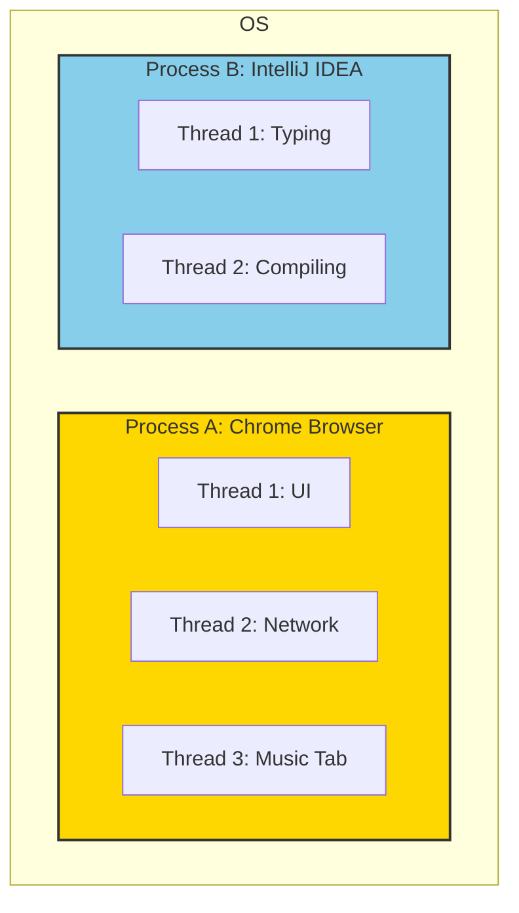
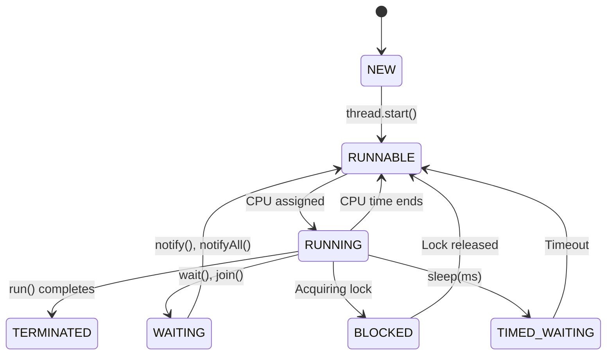

## 🤔 What & Why (Asal Enduku Ee Topic?)

### The Problem: Single-Minded Apps 🐢
Mawa, imagine nuvvu oka video game adutunnav. Same time lo, game lo music kuda play avvali. Nuvvu single-threaded application use chesthe, processor okate pani cheyagaladu. Ante, nuvvu character ni move chestunnapudu music aagipothundi, music play ayinappudu character aagipothundi. Chala irritating ga untadi kada? Daaniki solution ye multithreading.

### The Solution: Multitasking Apps 🚀
Multithreading ante, mana application okate sari chala panulu (tasks) cheyadam. Game lo character movement ki oka thread, music ki inko thread, enemy logic ki maro thread use cheste, anni panulu okesari jarugutunnattu anipistundi. Appudu game anedi smooth ga, responsive ga untundi. Idhe magic of multithreading!

### Real-World Analogy: Biryani House 🏠
Oka Biryani House anuko bro.
- **Process:** Whole Biryani House antha oka `Process`. Daaniki oka address (memory space) untadi.
- **Thread:** Andulo pani chese chefs and waiters `Threads`.
  - Chef 1 (Thread 1): Biryani prepare chestunnadu.
  - Chef 2 (Thread 2): Kebabs grill chestunnadu.
  - Waiter (Thread 3): Orders teskuntunnadu.

Andaru chefs kitchen (shared memory) ni use cheskuntaru, kaani prathi okariki valla own workspace (thread stack) untadi. Andaru kalisi pani cheste, customer ki food fast ga serve cheyochu. Okkade chef unte, anni panulu vade cheyali, chala late avtundi.

---

## 📚 Detailed Explanation

### 1. Process vs. Thread

Simple ga cheppalante:
- **Process:** Running program (e.g., Chrome browser, IntelliJ IDEA). Prathi process ki oka separate memory area (address space) untundi. Oka process inkoti memory ni direct ga chudaledu. Idi oka pedda intlanti (house) anuko.
- **Thread:** Process lo oka chinna part. Single process lo multiple threads undochu. Ee threads anni process yokka memory ni share cheskuntayi. Intlo unde manushulu (family members) anuko.

| Feature | Process | Thread |
|---|---|---|
| **Analogy** | Inti (House) | Intlo unde manishi (Person) |
| **Memory** | Separate memory space | Shares memory with other threads |
| **Creation** | Slow and resource-heavy | Fast and lightweight |
| **Communication** | Complex (Inter-Process Communication) | Easy (shared memory) |
| **Isolation** | High (oka process crash aythe, veredi safe) | Low (oka thread crash aythe, process antha crash avvochu) |

### 🧠 Mental Model Diagram: Process & Threads



### 2. Concurrency vs. Parallelism

Idi chala important mawa, confusion avvoddu.

- **Concurrency (ఒకేసారి பல పనులు చేస్తున్నట్లు అనిపించడం):**
  - **Analogy:** Oka chef okate stove (single-core CPU) meeda chicken curry and rice vundadam. Konchem curry chesi, adi simmer ayyelopu rice chustadu. Appudu rice simmer ayyelopu curry chustadu. Okate pani chestunnadu at a time, but rendu panulu progress avtunnayi. Fast ga switch avvadam valla, rendu panulu okesari jarugutunnattu anipistundi.
  - **Technical:** Running multiple tasks on a single CPU core by rapidly switching between them (Context Switching).

- **Parallelism (నిజంగా ఒకేసారి பல పనులు చేయడం):**
  - **Analogy:** Iddaru chefs (multi-core CPU) separate stoves meeda okaru chicken curry, inkokaru rice okesari prepare cheyadam. Ikkada rendu panulu *literally* at the same time jarugutunnayi.
  - **Technical:** Running multiple tasks simultaneously on multiple CPU cores.

#### 🧠 Mental Model Diagram: Concurrency vs Parallelism

```mermaid
graph TD
    subgraph Concurrency (Single-Core CPU)
        direction LR
        CPU_Core_1 -- Task A (10ms) --> CPU_Core_1 -- Task B (10ms) --> CPU_Core_1 -- Task A (10ms) --> CPU_Core_1
    end
    subgraph Parallelism (Multi-Core CPU)
        CPU_Core_2[CPU Core 1] -- Task A --> CPU_Core_2
        CPU_Core_3[CPU Core 2] -- Task B --> CPU_Core_3
    end
    style Concurrency fill:#FFD700
    style Parallelism fill:#90EE90
```

### 3. JVM Thread Architecture & Memory Model 🔥

Java lo manam create chese prathi thread ki, JVM konni memory areas ni allocate chestundi.

- **Shared Memory (Andari Threads ki common):**
  - **Heap Memory:** Objects anni ikkade store avtayi. Anni threads ee objects ni access cheyochu. Idi mana Biryani House lo kitchen anuko.
- **Private Memory (Prathi Thread ki separate):**
  - **Thread Stack:** Prathi thread ki oka separate stack untundi. Ee stack lo method calls (stack frames) and local variables store avtayi. Oka thread stack ni inko thread chudaledu. Idi chef ki valla personal cutting board anuko.

#### 🧠 Diagram: JVM Memory

```mermaid
graph TD
    subgraph JVM Memory
        subgraph Shared Between All Threads
            Heap[Heap Memory (Objects)]
            Metaspace[Metaspace (Class metadata)]
        end
        subgraph Per-Thread Memory
            Thread1[Thread 1] --> T1_Stack[Stack 1]
            Thread2[Thread 2] --> T2_Stack[Stack 2]
        end
    end
    style Shared Between All Threads fill:#FF6B6B
    style Per-Thread Memory fill:#87CEEB
```

### 4. Thread Lifecycle & States 🚦

Oka thread puttina daggarnunchi chanipoye varaku, adi different states lo untundi.

1.  **NEW:** `new Thread()` ani create chesinappudu, thread ee state lo untundi. Appude puttina baby anuko, inka em pani start cheyaledu.
2.  **RUNNABLE:** `thread.start()` call cheyagane, thread ee state ki vastundi. It's ready to run, but waiting for the CPU. "Nenu ready, CPU khali unte cheppu, pani start chesta" ani anukuntundi.
3.  **RUNNING:** Thread Scheduler CPU ni ee thread ki assign cheste, adi `run()` method ni execute cheyadam start chestundi. Ippudu thread actually pani chestundi.
4.  **BLOCKED/WAITING:** Thread oka lock kosam wait chestunte (`BLOCKED`), leda `thread.join()` or `object.wait()` call cheste (`WAITING`), or `Thread.sleep()` call cheste (`TIMED_WAITING`), adi temporary ga pause avtundi.
5.  **TERMINATED:** `run()` method complete ayipoyina tarvata or edaina exception vachina tarvata thread ee state ki vastundi. Pani aypoindi, thread chanipoindi.

#### 🧠 State Diagram: Thread Lifecycle



### 5. Context Switching

Mawa, single core CPU lo concurrency ela sadhyam? The answer is **Context Switching**.
CPU anedi chala fast ga threads madhyalo switch avtundi.

**Analogy:** Nuvvu phone lo chatting chestunnav, madhyalo oka notification vachindi. Nuvvu chat aapi, notification chusi, malli chat ki vastav. Ee process lo, nee brain (CPU) chat context nunchi notification context ki, malli venakki switch avtundi.

**Technical:** CPU thread A ni pause chesi, daani state (registers, program counter) ni save chesi, thread B state ni load cheskuni, daani execution start chestundi. Idi chala fast ga jarugutundi (milliseconds), so manaki anni panulu at a time jarugutunnayi anipistundi. Kaani, too much context switching performance ni debba teestundi.

### 6. Thread Scheduling in JVM

Multiple threads runnable state lo unte, deniki CPU ivvali anedi **Thread Scheduler** decide chestundi. Idi JVM lo oka part. Idi chala factors meeda depend avtundi, like thread priority (`Thread.setPriority()`). Kaani, thread priority anedi just oka hint matrame, guarantee kadu. Thread scheduling anedi OS meeda kuda depend avtundi (e.g., Windows vs Linux). So, manam daani meeda ekkuva depend avvakudadu.

---

## ✅ Checkpoint: Did You Master This?

Munduku velle mundu, ee questions ki confident ga answer cheyagalava leda chusko:

- [ ] Process ki Thread ki teda enti, oka real-world example cheppagalava?
- [ ] Concurrency vs Parallelism ante enti? Mana daily life lo examples?
- [ ] JVM lo Heap and Stack memory ni threads ela use cheskuntayi?
- [ ] Oka thread yokka complete lifecycle states ni explain cheyagalava?
- [ ] Context switching ante enti, daani valla performance enduku taggutundi?

**✅ Ready?** → [Next: Creating & Managing Threads](./02-Creating-and-Managing-Threads.md)

**😕 Need Review?** → Paiki scroll chesi, clear leni sections malli chudu.

**💬 Questions?** → Note chesko, manam next concepts tho link cheddam!
