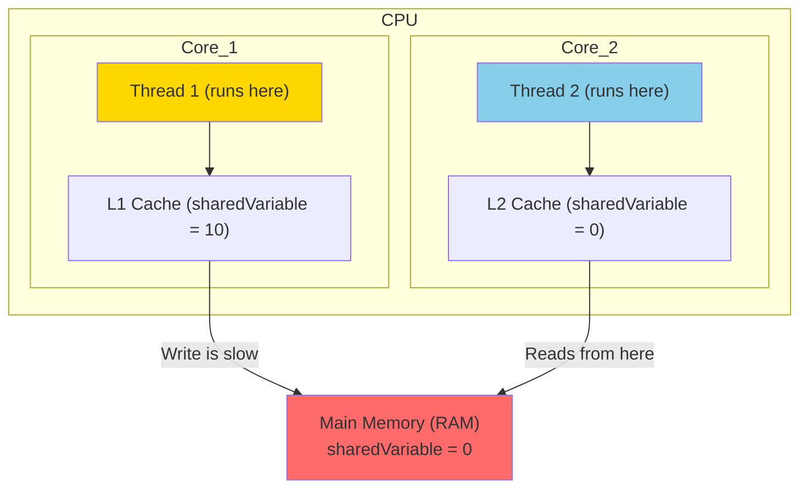

## 🤔 What & Why

### The Problem: "Naa System lo Work Avtundi!" 🤷‍♂️
Mawa, multithreading lo a biggest headache-inducing problem entante, code nee machine (single core) lo perfectly work avtundi, but production (multi-core) lo fail avtundi. Enduku? Oka thread chesina changes inko thread ki kanipinchakapovadam valla. Ee "visibility" problems enduku vastayo cheppede **Java Memory Model (JMM)**.

### The Solution: A Set of Rules for Memory
JMM anedi oka specification. Ante, konni rules. Ee rules, threads memory tho ela interact avtayi, and oka thread chesina changes inko thread ki eppudu kanipistayi anedi define chestayi. Ee rules telisthe, manam thread-safe code rayagalam.

### Real-World Analogy: Shared Google Doc 📝
Imagine, nuvvu and nee friend okate Google Doc lo pani chestunnaru.
- **Main Memory (RAM):** The actual Google Doc on the server.
- **CPU Cache (Thread's local memory):** Nuvvu document ni offline lo edit cheyadaniki nee laptop lo save cheskunna cached version.
- **Visibility Problem:** Nuvvu nee local copy lo chala changes chesav, kaani "Sync" cheyaledu. Appudu nee friend ki aa changes kanipinchavu. Vadu paatha content chustu pani chestadu. Rendu versions sync chesinappudu data inconsistency vastundi.

JMM ee "sync" process eppudu, ela jaragalo cheptundi.

---

## 📚 Detailed Explanation

### 1. Main Memory vs. Thread Cache

Modern computer architecture lo, CPU ki and Main Memory (RAM) ki madhyalo chala fast ga unde **CPU Caches** (L1, L2, L3) untayi.
- **Why Caches?** RAM anedi CPU tho compare cheste chala slow. So, CPU eppudu RAM ki velli data techukunte performance padipotundi. Anduke, frequent ga use chese data ni CPU caches lo pettukuntundi.

**Multithreading lo problem enti?**
- Prathi CPU core ki valla own cache untadi.
- Thread 1, Core 1 meeda run avtundi anuko. Thread 2, Core 2 meeda run avtundi.
- Rendu threads `sharedVariable` ni access chestunnayi.
- Thread 1 `sharedVariable` ni `10` ga marchindi. Ee change first Core 1 cache lo update avtundi.
- Thread 2 `sharedVariable` ni chuste, daaniki inka paatha value (Core 2 cache lo or main memory lo unna value) kanipinchochu. Endukante, Thread 1 chesina change inka main memory ki write avvaledu (or Thread 2 cache update avvaledu).
- This is the **VISIBILITY PROBLEM**.

#### 🧠 Mental Model Diagram: The Cache Problem



### 2. Instruction Reordering 🔄

Performance improve cheyadaniki, compiler and CPU manam rasina code order ni marchochu! Ee process ni **Reordering** antaru. Single thread lo, idi problem kadu, endukante final result same untundi.

**Example:**
```java
int x = 10;
int y = 20;
```
Compiler or CPU deeni `int y = 20; int x = 10;` ga marchochu. Single thread lo farak padadu.

**Multithreading lo problem enti?**
Oka thread lo reordering jaragadam valla, inko thread ki wrong values kanipinchochu.

**Scenario:**
```java
// Shared variables
int a = 0;
boolean flag = false;

// Thread 1
public void writer() {
    a = 1;      // Statement 1
    flag = true; // Statement 2
}

// Thread 2
public void reader() {
    if (flag) {         // Statement 3
        System.out.println(a); // Statement 4
    }
}
```
Manam expect chesedi: `1` print avtundi ani.
Kaani, Thread 1 lo reordering jarigi, `flag = true;` mundu execute ayyi, `a = 1;` tarvata execute avvochu.
Appudu, Thread 2 `flag` ni `true` ga chusi, lopaliki velli `a` ni print chestundi. Appatiki `a` inka `0` ga ne undochu! So output `0` vastundi! This is a disaster.

### 3. Happens-Before Relationship  GUARANTEE

Ee visibility and reordering problems ni solve cheyadaniki, JMM "Happens-Before" ane concept ni introduce chesindi. Idi oka guarantee.

**Rule:** If action A *happens-before* action B, then the results of A are guaranteed to be visible to B.

JMM konni specific situations lo ee guarantee istundi:
1.  **Program Order Rule:** Same thread lo, mundu rasina statement tarvata rasina statement ki happens-before.
2.  **Monitor Lock Rule:** Oka lock ni `unlock` cheyadam, tarvata ade lock ni `lock` cheyadaniki happens-before. (🔥 Manam `synchronized` lo chustam).
3.  **Volatile Variable Rule:** Oka `volatile` variable ki write cheyadam, tarvata ade variable ni read cheyadaniki happens-before. (🔥 Manam `volatile` lo chustam).
4.  **Thread Start Rule:** `thread.start()` call cheyadam, aa thread lo ye statement execute avvadaniki aina happens-before.
5.  **Thread Join Rule:** Inko thread pani aypovadam (`join()` returns), current thread lo `join()` tarvata unna statements ki happens-before.

Ee rules unna chota, JMM reordering cheyadu and memory visibility ni guarantee chestundi. Vere chotla, no guarantee!

---
## 🔥 Key Takeaways

1.  **Memory is not flat:** Threads data ni direct ga Main Memory nunchi kakunda, fast CPU caches nunchi kuda teskuntayi.
2.  **Changes are not immediate:** Oka thread chesina changes inko thread ki ventane kanipinchali ani rule ledu. This is the **visibility problem**.
3.  **Order is not guaranteed:** Compiler/CPU performance kosam code ni reorder cheyochu.
4.  **`happens-before` is your guarantee:** JMM manaki konni rules (like `synchronized`, `volatile`) ichindi. Avi use cheste, visibility and ordering guarantee untundi. Avi use cheyakapothe, code multi-core systems lo fail avvochu.

---

## ✅ Checkpoint: Did You Master This?

- [ ] "Visibility problem" ante enti? Oka real-world analogy cheppagalava?
- [ ] Code reordering ante enti, and multithreading lo adi enduku dangerous?
- [ ] Happens-Before relationship enduku important?
- [ ] JMM lekunda unte, manam face chese top 2 problems enti?

**✅ Ready?** → [Next: Phase 2 - Synchronization & Thread Safety](../02-Synchronization-Thread-Safety/01-Race-Conditions.md) (Ikkada manam JMM problems ki solutions chustam!)

**😕 Need Review?** → Paiki scroll chesi diagrams and analogy malli chudu.
