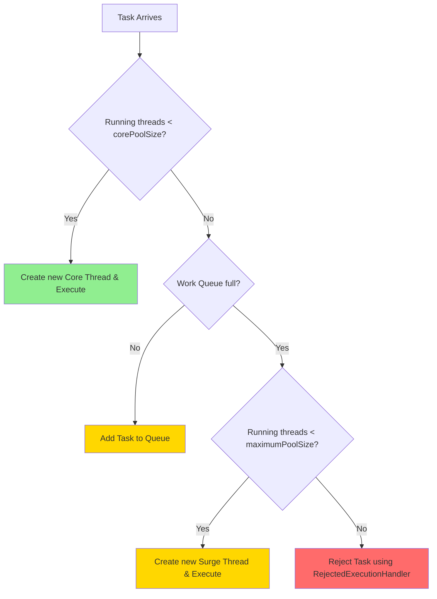

## 🤔 What & Why

### The Problem: The `Executors` Factory Hides Too Much! 🤫
Mawa, `Executors.newFixedThreadPool()` lanti methods chala easy ga unnayi, kaani avi chala important details ni దాచేస్తాయి.
- `newFixedThreadPool()` and `newSingleThreadExecutor()` create chese pools ki **unbounded queue** (`Integer.MAX_VALUE` size) untundi. Ante, tasks vastune unte, queue perigipoyi mee application memory antha tini, `OutOfMemoryError` tho crash avtundi. 💥
- `newCachedThreadPool()` create chese pool **unlimited threads** (`Integer.MAX_VALUE` max size) create cheyagaladu. Oka chinna bug valla tasks perigipothe, system lo thousands of threads create aypoyi, OS level lo crash avtundi. 💣

**Production lo ee "defaults" chala dangerous.** Manaki full control kavali.

### The Solution: Build Your Own Pool with `ThreadPoolExecutor` 🛠️
`ThreadPoolExecutor` anedi `ExecutorService` yokka core implementation. `Executors` factory methods kuda back-end lo deenine use chestayi. Direct ga `ThreadPoolExecutor` constructor ni use chesi, manam thread pool yokka prathi aspect ni control cheyochu.

### Real-World Analogy: Building a Custom PC 🖥️ vs. Buying a Laptop 💻
- **`Executors` Factory:** Idi oka pre-built laptop konnattu. Easy, fast, kaani nuvvu RAM upgrade cheyalente or better graphics card pettalante kastam. Limited options.
- **`ThreadPoolExecutor` Constructor:** Idi custom PC build chesinattu. Nuvve CPU (`corePoolSize`), extra RAM slots (`maximumPoolSize`), motherboard (`workQueue`), and power supply (`RejectedExecutionHandler`) select cheskuntav. Initial ga konchem complex anipinchina, performance and control nee chetilo untundi.

---

## 📚 Detailed Explanation: The 7 Constructor Arguments

`ThreadPoolExecutor` yokka most powerful constructor idi:
```java
public ThreadPoolExecutor(
    int corePoolSize,
    int maximumPoolSize,
    long keepAliveTime,
    TimeUnit unit,
    BlockingQueue<Runnable> workQueue,
    ThreadFactory threadFactory,
    RejectedExecutionHandler handler
)
```

1.  **`corePoolSize`:** Pool lo eppudu undalsina minimum number of threads. Restaurant lo permanent chefs laaga. Traffic lekapoyina, వీళ్ళుంటారు.
2.  **`maximumPoolSize`:** Pool lo undagalige maximum number of threads. Peak hours lo piliche temporary/freelance chefs laaga. `corePoolSize` threads anni busy aiyyi, `workQueue` kuda full aipothe, appudu kotha threads ee limit varaku create avtayi.
3.  **`keepAliveTime` & `unit`:** `corePoolSize` kanna ekkuva unna extra threads (freelance chefs), em pani lekunda unte entha time tarvata terminate avvalo ee parameters cheptayi.
4.  **`workQueue`:** `corePoolSize` threads anni busy ga unte, kotha tasks vachi ekkada wait chestayo ade ee `BlockingQueue`. Idi chala critical parameter.
    - `ArrayBlockingQueue<Runnable>(100)`: **Bounded Queue.** Fixed size (e.g., 100). Production ki safe choice.
    - `LinkedBlockingQueue<Runnable>()`: **Unbounded Queue.** Size limit undadu (`Integer.MAX_VALUE`). **Dangerous!** `newFixedThreadPool` idi use chestundi.
    - `SynchronousQueue<Runnable>()`: **Direct Handoff.** Queue lo space undadu. Task ni direct ga waiting thread ki handoff chestundi. Thread lekapothe, kotha thread create cheyadaniki try chestundi. `newCachedThreadPool` idi use chestundi.
5.  **`threadFactory`:** Threads ni ela create cheyalo cheptundi. Manam deenitho threads ki custom names pettukovachu, debugging chala easy avtundi.
6.  **`handler`:** Threads anni busy aiyyi, queue kuda full aipothe, kotha task ni em cheyalo ee `RejectedExecutionHandler` decide chestundi.

#### 🧠 Mental Model Diagram: How a Task is Handled



---

## 💻 Code Examples

### Example 1: Creating a Custom, Production-Ready Thread Pool 🏭

**Scenario:** Manam oka robust, production-grade thread pool ni create cheddam.
- Core Threads: 2
- Max Threads: 4
- Keep Alive: 1 minute
- Queue: Bounded, size 10
- Thread Names: `worker-thread-1`, `worker-thread-2`...
- Rejection Policy: `CallerRunsPolicy` (deen gurinchi kinda chuddam)

#### ✅ Success Case: Building from Scratch
```java
// File: com/example/custom/CustomThreadPool.java
package com.example.custom;

import java.util.concurrent.*;
import java.util.concurrent.atomic.AtomicInteger;

// ✅ Custom ThreadFactory to name our threads
class WorkerThreadFactory implements ThreadFactory {
    private final AtomicInteger threadNumber = new AtomicInteger(1);
    private final String namePrefix;

    WorkerThreadFactory(String poolName) {
        this.namePrefix = poolName + "-worker-";
    }

    public Thread newThread(Runnable r) {
        Thread t = new Thread(r, namePrefix + threadNumber.getAndIncrement());
        if (t.isDaemon()) t.setDaemon(false);
        if (t.getPriority() != Thread.NORM_PRIORITY) t.setPriority(Thread.NORM_PRIORITY);
        System.out.println("Created new thread: " + t.getName());
        return t;
    }
}

public class CustomThreadPool {
    public static void main(String[] args) {
        int corePoolSize = 2;
        int maximumPoolSize = 4;
        long keepAliveTime = 10;
        TimeUnit unit = TimeUnit.SECONDS;
        BlockingQueue<Runnable> workQueue = new ArrayBlockingQueue<>(10);
        ThreadFactory threadFactory = new WorkerThreadFactory("MyPool");
        RejectedExecutionHandler rejectionHandler = new ThreadPoolExecutor.CallerRunsPolicy();

        // ✅ Creating the executor
        ThreadPoolExecutor executor = new ThreadPoolExecutor(
                corePoolSize,
                maximumPoolSize,
                keepAliveTime,
                unit,
                workQueue,
                threadFactory,
                rejectionHandler
        );

        System.out.println("Submitting 20 tasks...");
        for (int i = 1; i <= 20; i++) {
            final int taskId = i;
            executor.execute(() -> {
                System.out.println("Executing task " + taskId + " on thread " + Thread.currentThread().getName());
                try {
                    TimeUnit.SECONDS.sleep(2);
                } catch (InterruptedException e) {
                    Thread.currentThread().interrupt();
                }
            });
        }

        executor.shutdown();
    }
}
```

---

### Example 2: Understanding `RejectedExecutionHandler` 🛑

Pool `maxPoolSize` ki reach aiyyi, `workQueue` kuda full aipothe, kotha tasks reject avtayi. Ee rejection ni ela handle cheyalo chuddam.

#### ❌ Failure Case: Default `AbortPolicy`
By default, `ThreadPoolExecutor` `AbortPolicy` use chestundi. Idi direct ga `RejectedExecutionException` throw chestundi.
```java
// Same setup as above, but with AbortPolicy
// RejectedExecutionHandler rejectionHandler = new ThreadPoolExecutor.AbortPolicy();
// ... submit 20 tasks
```
**Error Message:**
```
Exception in thread "main" java.util.concurrent.RejectedExecutionException: Task ... rejected from java.util.concurrent.ThreadPoolExecutor@...
```
**Why This Fails:** Exception vachaka, app crash avvochu or task lost avvochu. Idi graceful degradation kadu.

#### ✅ Solution: Better Rejection Policies

1.  **`CallerRunsPolicy`:**
    - **What it does:** Reject cheyakunda, task ni submit chesina thread (`main` thread in our case) meede run chestundi.
    - **Why it's good:** Idi oka natural back-pressure mechanism. `main` thread task run cheyadam lo busy ga untundi kabatti, adi inka kotha tasks ni submit cheyaledu. System ki breathing space istundi.
    - **Output with `CallerRunsPolicy`:**
      ```
      ...
      Executing task 16 on thread main  // <-- Notice this!
      ...
      ```

2.  **`DiscardPolicy`:**
    - **What it does:** Task ni silently discard chestundi. Exception రాదు, emi జరగదు. Task just lost.
    - **When to use:** Data loss anedi acceptable aite (e.g., logging non-critical events).

3.  **`DiscardOldestPolicy`:**
    - **What it does:** Queue lo unna oldest task ni discard chesi, kotha task ni add chestundi.
    - **When to use:** Latest data process cheyadam important anukunnappudu.

4.  **Custom Handler:**
    - Manam `RejectedExecutionHandler` interface ni implement chesi, custom logic rayochu (e.g., task ni database lo save cheyochu for later processing).

#### 🔗 Concept Connections:
- **Uses from:** `BlockingQueue` concept from [Phase 8](../08-Concurrent-Collections/03-Blocking-Queues.md) (But we are giving a heads-up here).
- **Will be used in:** Ee custom pool anedi `CompletableFuture` (Phase 7) tho combine chesinappudu chala powerful avtundi.

---

## 🐛 Debugging Guide

### Common Issue: Thread Pool Deadlock
**Symptom:** Application antha freeze aypotundi. Tasks submit avtayi kaani execute avvavu. Thread dump teesinappudu, pool lo unna threads anni `WAITING` or `BLOCKED` state lo untayi.
**Meaning:** Idi oka classic problem. Nuvvu oka task ni thread pool ki submit chesav. Aa task, tana logic lo, inko task result kosam wait chestundi (e.g., `future.get()`). Kaani ee "inko task" kuda adhe thread pool lo execute avvali. Pool lo unna threads anni alane wait chestunte, kotha tasks (aa "inko task" tho saha) eppatiki run avvavu.
**Solution:**
1.  **Separate Pools for Separate Concerns:** Short-running tasks ki oka pool, long-running/blocking tasks ki inko separate pool use chey.
2.  **Increase Pool Size:** Okavela threads anni block avtunnayi ante, nee pool size chinnaga undochu. `maximumPoolSize` penchi chudu.
3.  **Use Asynchronous Callbacks:** `future.get()` (blocking call) badulu, `CompletableFuture` (Phase 7 lo chustam) lanti non-blocking, callback-based approaches use chey.

### Monitoring with `ThreadPoolExecutor` Methods
Debugging chesetappudu, ee methods chala useful:
- `getPoolSize()`: Currently pool lo enni threads unnayi.
- `getActiveCount()`: Enni threads currently tasks execute chestunnayi.
- `getQueue().size()`: Enni tasks queue lo waiting.
- `getCompletedTaskCount()`: Ippativaraku enni tasks complete ayyayi.

Ee stats ni periodically log cheste, pool health meeda oka clear idea vastundi.

---

## 🧪 Testing Examples

### Unit Test: Testing a Custom Rejection Policy
**Scenario:** Manam oka custom rejection handler rayali, adi rejected tasks ni log chesi, oka metric ni increment cheyali. Daanini test cheddam.
```java
// File: com/example/testing/CustomRejectionHandler.java
package com.example.testing;

import java.util.concurrent.RejectedExecutionHandler;
import java.util.concurrent.ThreadPoolExecutor;
import java.util.concurrent.atomic.AtomicInteger;

public class CustomRejectionHandler implements RejectedExecutionHandler {
    private final AtomicInteger rejectedCount = new AtomicInteger(0);

    @Override
    public void rejectedExecution(Runnable r, ThreadPoolExecutor executor) {
        // Log the rejection
        System.out.println("Task rejected: " + r.toString());
        // Increment a metric
        rejectedCount.incrementAndGet();
    }

    public int getRejectedCount() {
        return rejectedCount.get();
    }
}

// File: com/example/testing/CustomRejectionHandlerTest.java
package com.example.testing;

import org.junit.jupiter.api.Test;
import static org.junit.jupiter.api.Assertions.assertEquals;

import java.util.concurrent.*;

public class CustomRejectionHandlerTest {
    @Test
    void testRejectionHandlerIsInvoked() throws InterruptedException {
        // Arrange
        CustomRejectionHandler handler = new CustomRejectionHandler();
        // Create a pool that will surely reject tasks: size 1, queue size 1
        ThreadPoolExecutor executor = new ThreadPoolExecutor(1, 1, 0L, TimeUnit.SECONDS, new ArrayBlockingQueue<>(1), handler);

        // Act
        // Submit 3 tasks. 1st will execute, 2nd will go to queue, 3rd will be rejected.
        executor.submit(() -> { try { Thread.sleep(1000); } catch (Exception e) {} });
        executor.submit(() -> {});
        executor.submit(() -> {}); // This one should be rejected

        Thread.sleep(100); // Give time for rejection to happen

        // Assert
        assertEquals(1, handler.getRejectedCount());

        executor.shutdown();
    }
}
```

---

## ❌ Anti-Patterns

### Anti-Pattern: Misconfigured `maximumPoolSize`
**What's Wrong:** `corePoolSize = 10`, `maximumPoolSize = 20`, kaani `workQueue` anedi `new LinkedBlockingQueue<>()` (unbounded).
**Why Bad:** `ThreadPoolExecutor` logic prakaram, `maximumPoolSize` anedi **queue full aite matrame** use avtundi. Nuvvu unbounded queue use chestunnav kabatti, adi eppatiki full avvadu. So, nee pool lo eppudu maximum 10 threads matrame untayi. Aa `maximumPoolSize=20` anedi completely useless. Extra threads create avvavu.
**✅ Correct Way:** Bounded queue (e.g., `ArrayBlockingQueue`) use chesinappude `maximumPoolSize` ki meaning untundi.

---

## ⚡ Performance & Optimization

### `allowCoreThreadTimeOut()`
- By default, `corePoolSize` lo unna threads eppudu terminate avvavu. Kaani, nee application ki traffic chala unpredictable ga unte (e.g., night time lo almost zero traffic), ee core threads ni kuda terminate cheyochu.
- `executor.allowCoreThreadTimeOut(true);` ani set cheste, `keepAliveTime` anedi core threads ki kuda apply avtundi.

### `prestartAllCoreThreads()`
- By default, `ThreadPoolExecutor` tasks vachinappude threads create chestundi. Kaani nee application start avvagane, konni threads ready ga undali anukunte, ee method use cheyochu.
- `executor.prestartAllCoreThreads();` call cheste, `corePoolSize` lo unna threads anni ముందే create aypotayi. First request ki response time improve avtundi.

---

## ✨ Key Takeaways (Top 5)

1.  **`Executors` is for Demos, `ThreadPoolExecutor` is for Production 🏭:** Production lo control antha mana chetilo undali. So always prefer the constructor.
2.  **The Queue is Everything 🚦:** `workQueue` selection anedi mee pool behavior ni completely define chestundi. Unbounded queues ni avoid chey. Bounded queues + `RejectedExecutionHandler` is the safest combo.
3.  **`maxPoolSize` is Not a Magic Bullet 🔫:** Unbounded queue tho `maxPoolSize` useless. Adi kevalam bounded queue full ayyaka matrame picture loki vastundi.
4.  **Name Your Threads 🏷️:** `ThreadFactory` use chesi threads ki meaningful names ivvadam debugging lo chala time save chestundi. Idi optional kadu, mandatory practice anuko.
5.  **Monitor, Monitor, Monitor 📊:** `getActiveCount()`, `getQueue().size()` lanti metrics ni use chesi, nee thread pool health ni eppudu kanipetukuni undali.

---

## 💪 Practice Exercises

### Exercise 1 (Hard): ⭐⭐⭐
**Problem:** Oka custom `ThreadPoolExecutor` create chey.
- `corePoolSize`: 2
- `maximumPoolSize`: 3
- `keepAliveTime`: 10 seconds
- `workQueue`: `ArrayBlockingQueue` of size 2
- `RejectedExecutionHandler`: Rejected task ni `System.err` lo print cheyali.
Ee pool ki 10 tasks submit chey (prathi task 2 seconds sleep avvali). Output ni observe chesi, prathi task (execute ayinda, queue loki vellinda, reject ayinda) em ayindo explain chey.

---

## 📝 Quick Reference Card

| TPE Parameter | What it Controls | Production-Safe Value |
|---|---|---|
| `corePoolSize` | Minimum # of threads | `No. of CPU Cores` (for CPU-bound) |
| `maximumPoolSize`| Maximum # of threads | Depends on task type |
| `keepAliveTime` | Idle timeout for extra threads| `10-60 seconds` |
| `workQueue` | Task buffer | `new ArrayBlockingQueue<>(size)` (Bounded!) |
| `threadFactory` | Thread creation logic | Custom impl with naming |
| `handler` | Rejection strategy | `CallerRunsPolicy` or custom |

---

## ✅ Checkpoint: Did You Master This?
- [ ] `Executors.newFixedThreadPool(10)` create chestunna `ThreadPoolExecutor` yokka 7 parameters values emi untayi? (Hint: Queue type?)
- [ ] `corePoolSize` vs `maximumPoolSize` - clear ga explain cheyagalava?
- [ ] `CallerRunsPolicy` anedi back-pressure ni ela create chestundi?
- [ ] Production lo `LinkedBlockingQueue` (unbounded) enduku use cheyakudadu?

**✅ Ready?** → [Next: ScheduledExecutors and Lifecycle](./04-ScheduledExecutors-and-Lifecycle.md)

**😕 Need Review?** → Paiki scroll chesi, Custom PC analogy and the task handling flowchart malli chudu.
