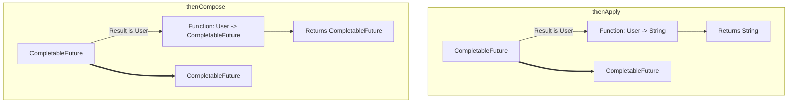

## 🤔 What & Why

### The Problem: `future.get()` is the Enemy of Asynchronicity! 👿
Mawa, manam last time `supplyAsync` use chesam, kani result kosam `future.get()` use chesi block chesam. Adi asynchronous programming yokka main purpose ni debba testundi. Manaki కావలసింది, "oka task aypogane, block cheyakunda, inko task start chey" ane mechanism.

**Real Scenario:**
1.  User ID teskuni, user details ni fetch chey (`Task A`).
2.  User details vachaka, daantlo unna `addressId` tho, user address ni fetch chey (`Task B`).
3.  Address vachaka, daanni screen meeda display chey (`Task C`).

`Future` tho idi cheyali ante, manam ilantidi rayali:
`Address address = getAddress(getUser(userId).get().getAddressId()).get();`
Ikkada manam rendu sarlu `.get()` tho block avtunnam. Idi efficient kadu.

### The Solution: Building Pipelines with `thenApply`, `thenAccept`, and `thenRun` ⛓️
`CompletableFuture` (CF) manaki ee problem solve cheyadaniki chala powerful callback methods istundi. Ee methods anni `CompletionStage` interface nunchi vastayi.

- **`thenApply(Function<T, U> fn)`:**
  - **Purpose:** Oka CF complete ayyaka, daani result ni teskuni, daani meeda oka function ni apply chesi, **inko kotha result** ni return cheyadaniki.
  - **Analogy:** "Pizza ready avvagane, daanini slice chesi, sliced pizza ni ivvu."
  - **Input:** `Function<T, U>` (takes T, returns U)
  - **Returns:** `CompletableFuture<U>`

- **`thenAccept(Consumer<T> action)`:**
  - **Purpose:** Oka CF complete ayyaka, daani result ni teskuni, daani meeda oka action perform cheyadaniki. **Result em return cheyadu.**
  - **Analogy:** "Pizza ready avvagane, daanini teskuni tinu." (Tineyadam anedi action, adi em return cheyadu).
  - **Input:** `Consumer<T>` (takes T, returns void)
  - **Returns:** `CompletableFuture<Void>`

- **`thenRun(Runnable action)`:**
  - **Purpose:** Oka CF complete ayyaka, oka action perform cheyadaniki. Deeniki previous result tho sambandam ledu.
  - **Analogy:** "Pizza ready avvagane, 'Bon Appétit!' ani message pampu."
  - **Input:** `Runnable` (takes nothing, returns void)
  - **Returns:** `CompletableFuture<Void>`

#### `*Async` Suffix
Prathi method ki `...Async` version kuda untundi (e.g., `thenApplyAsync`).
- `thenApply()`: Previous task ye thread lo run aindo, adhe thread lo (or main thread lo) run avtundi.
- `thenApplyAsync()`: `ForkJoinPool.commonPool()` lo run avtundi.
- `thenApplyAsync(executor)`: Manam ichina custom executor lo run avtundi.
**Rule of Thumb:** Quick, non-blocking operations ki regular version vadu. Long-running or blocking (I/O) operations ki eppudu `...Async` version with a custom executor vadali.

---

## 📚 Detailed Explanation: `thenCompose` vs `thenCombine`

Ivi rendu inka powerful methods, multiple CFs tho pani cheyadaniki.

### `thenCompose(Function<? super T, ? extends CompletionStage<U>> fn)`
- **Purpose:** Oka `CompletableFuture` result meeda depend ayyi, **inko `CompletableFuture`** ni create cheyadaniki. Dependent async calls ni chain cheyadaniki.
- **Analogy:** "User details fetch chey (`CF1`). Aa details lo unna `addressId` tho, address ni fetch chey (`CF2`)." Ikkada `CF2` anedi `CF1` result meeda depend aindi.
- **Input:** A function that takes a value and returns a `CompletableFuture`.
- **Returns:** A `CompletableFuture<U>`. It returns the "inner" future, so you don't get `CompletableFuture<CompletableFuture<Address>>`.

### `thenCombine(CompletionStage<? extends U> other, BiFunction<? super T, ? super U, ? extends V> fn)`
- **Purpose:** Rendu **independent** `CompletableFuture`s complete ayyaka, vaati rendu results ni combine cheyadaniki.
- **Analogy:** "Parallel ga oka pakkana pizza prepare chey (`CF1`), inko pakkana cool drink teskochi pettu (`CF2`). Rendu ready avvagane, 'pizza and drink' combo ni serve chey."
- **Input:** Another `CompletableFuture` and a `BiFunction` that takes two results and returns one.
- **Returns:** A `CompletableFuture<V>`.

#### 🧠 Mental Model Diagram: `thenApply` vs `thenCompose`



---

## 💻 Code Examples

### Example 1: `thenApply` and `thenAccept` Chain
**Scenario:** User ID nunchi user details fetch chey, tarvata user name ni uppercase chey, tarvata aa name ni print chey.
```java
// File: com/example/chaining/ThenApplyAccept.java
package com.example.chaining;

import java.util.concurrent.CompletableFuture;

public class ThenApplyAccept {
    public static void main(String[] args) {
        CompletableFuture.supplyAsync(() -> "Mawa") // 1. Start with a supplier
            .thenApply(name -> "Hello, " + name)   // 2. Apply a function
            .thenApply(greeting -> greeting.toUpperCase()) // 3. Chain another function
            .thenAccept(result -> System.out.println("Final Result: " + result)); // 4. Final action

        // Main thread can do other things...
        try { Thread.sleep(100); } catch (Exception e) {}
    }
}
```

### Example 2: `thenCompose` for Dependent Calls
**Scenario:** User details fetch chey, tarvata aa user yokka permissions fetch chey.
```java
// File: com/example/dependent/ThenComposeDemo.java
package com.example.dependent;

import java.util.concurrent.CompletableFuture;

public class ThenComposeDemo {

    // Simulates fetching user details by ID
    static CompletableFuture<String> getUserDetails(int userId) {
        return CompletableFuture.supplyAsync(() -> "User" + userId + ":Details");
    }

    // Simulates fetching permissions for a user
    static CompletableFuture<String> getPermissions(String userDetails) {
        return CompletableFuture.supplyAsync(() -> userDetails + ":Permissions");
    }

    public static void main(String[] args) {
        // We want to get permissions for user 101
        getUserDetails(101)
            .thenCompose(details -> getPermissions(details))
            .thenAccept(permissions -> System.out.println("Got permissions: " + permissions));

        try { Thread.sleep(100); } catch (Exception e) {}
    }
}
```

### Example 3: `thenCombine` for Independent Calls
**Scenario:** Parallel ga product price and shipping cost fetch chesi, total cost calculate chey.
```java
// File: com/example/independent/ThenCombineDemo.java
package com.example.independent;

import java.util.concurrent.CompletableFuture;

public class ThenCombineDemo {
    public static void main(String[] args) {
        CompletableFuture<Double> priceFuture = CompletableFuture.supplyAsync(() -> 25.0);
        CompletableFuture<Double> shippingFuture = CompletableFuture.supplyAsync(() -> 5.0);

        priceFuture.thenCombine(shippingFuture, (price, shipping) -> price + shipping)
                   .thenAccept(total -> System.out.println("Total Cost: " + total));

        try { Thread.sleep(100); } catch (Exception e) {}
    }
}
```

---

## ✅ Checkpoint: Did You Master This?

- [ ] `thenApply`, `thenAccept`, `thenRun` - ee mooditiki madhyalo unna difference enti?
- [ ] `thenApply` ki `thenCompose` ki teda enti? Ekkada edi vadali?
- [ ] `thenCompose` ki `thenCombine` ki teda enti?
- [ ] Oka I/O operation chese task undi. Daaniki `thenApply` vadala or `thenApplyAsync` vadala? Why?

**✅ Ready?** → [Next: Error Handling and Advanced Usage](./04-Error-Handling-and-Advanced-Usage.md)
