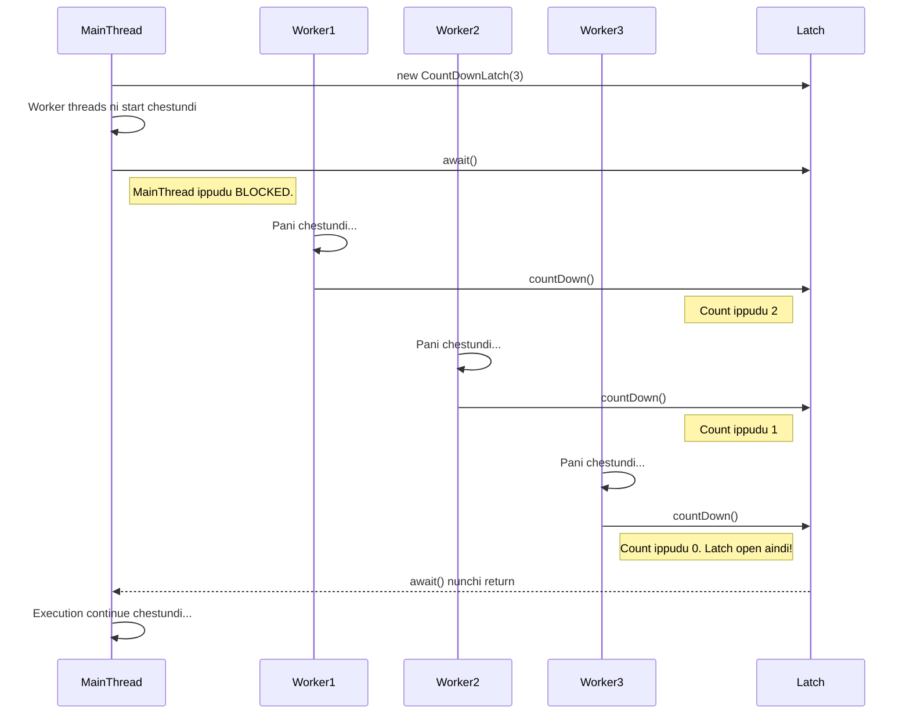

<!--
---
title: "Synchronizer: CountDownLatch"
---
-->

> **Learning Path Position**
>
> Phase 9: Synchronizers ➔ **Chunk 1: CountDownLatch**

> **Prerequisites**
>
> *   Phase 1: Thread Lifecycle (manam `join()` gurinchi telusukovali)
> *   Phase 6: Executor Framework (worker threads ni manage cheyyadaniki)

> **Coming After This**
>
> *   Phase 9, Chunk 2: `CyclicBarrier`
> *   Phase 9, Chunk 3: `Semaphore`

---

### 🚀 1. What & Why: `CountDownLatch`?

Mawa, ippativaraku manam `thread.join()` use chesam okari kosam okaru wait cheyyadaniki. Kani manam **multiple** threads kosam wait cheyyali ante? Prathi thread mida `join()` call cheyyadam antha clean ga undadu.

Deeni kosam `CountDownLatch` oka flexible and powerful solution. Idi oka synchronizer, deeni valla oka thread migatha threads lo jarige operations complete ayye varaku wait cheyyagaladu.

**Deeni valla use enti? 🤔**

*   **Startup Synchronization 🏁:** Application ready avvadaniki mundu, main thread chala critical services (database connection, network service, etc.) parallel ga initialize ayye varaku wait cheyyochu.
*   **Parallel Task Completion 🎯:** Oka 'master' thread chala 'worker' threads ki work assign chesi, anni threads pani purthi chese varaku wait chesi, taruvatha results ni aggregate cheyyochu.
*   **Testing 🧪:** Concurrent code ni test cheyyadaniki idi chala baguntundi. Assertions chese mundu, nee test threads anni oka certain point ki reach ayyayo ledo anedi ee `CountDownLatch` tho confirm chesukovachu.

---

### analogy 2. Real-World Analogy: Race Starting Gate 🏇

Imagine chesuko, oka horse race jarugutondi. Race official (main thread) race ni start cheyyali anukuntunnadu, kani anni horses starting gates lo set ayye varaku aagali.

*   **The Latch:** Official daggara oka checklist (`CountDownLatch`) untundi, danilo enni horses unnayo antha count untundi. For example, 5 horses unte, initial count 5.
*   **`countDown()`:** Prathi horse gate lo ready avvagane, valla handler 'Ready!' ani arustadu, appudu official checklist lo oka horse ni tick chestadu. Ide `countDown()` method. Count 5 nunchi 4, taruvatha 3, alaga taggutundi.
*   **`await()`:** Race official start cheyyadaniki pistol tho ready ga unnadu, kani checklist ni chustu aagutunnadu. Checklist lo count zero ayye varaku aayana pistol fire cheyyaledu. Ide `await()` method.
*   **Latch Opens:** Aido horse ready avvagane, count 0 avutundi. Latch 'open' avutundi, ventane official pistol fire chesi race start chestadu.

Mukhyamga, okasari race start ayyaka, ade checklist ni next race ki use cheyyalem. Oka `CountDownLatch` anedi **one-time** event matrame.

---

### 🧠 3. Mental Model (Mermaid Diagram)



---

### ✍️ 4. Detailed Explanation & Key Methods

`CountDownLatch` ni manam oka initial count tho start chestam.

*   `CountDownLatch(int count)`: Idi constructor. Manam enni events kosam wait cheyyalo aa number ikkada istham.

*   `void await() throws InterruptedException`: "Waiting" thread ee method ni call chestundi. Idi current thread ni latch count zero ayye varaku block chestundi. Wait chestunnapudu interrupt aite, `InterruptedException` vastundi.

*   `boolean await(long timeout, TimeUnit unit) throws InterruptedException`: Idi `await()` lanti method, kani kontha time varaku matrame wait chestundi. Timeout loపు count zero aite `true` return chestundi, lekapothe `false` return chestundi.

*   `void countDown()`: "Worker" threads ee method ni call chestayi. Idi latch count ni okati taggistundi. Count zero avvagane, wait chestunna threads anni release avutayi.

*   `long getCount()`: Current count ni return chestundi.

**Important:** `CountDownLatch` ni reset cheyyalem. Okasari count zero aindante, adi eppatiki open ga ne untundi. Manaki reusable barrier kavali ante, `CyclicBarrier` use cheyyali.

---

### 💻 5. Code Example: Application Startup Manager

**Scenario:** Manam oka application build chestunnam, adi 3 services mida depend ayyi undi: `DatabaseService`, `CacheService`, and `LoggingService`. Ee services anni parallel ga start avvochu, kani main application thread matram anni 'up' ani confirm ayyake munduku vellali.

**👎 Failure Case (`countDown()` call miss aite):**
Okavela oka service thread lo exception vachi adi `countDown()` ni call cheyyadam marchipothe, `main` thread eppatiki `await()` lo ne undipotundi (ledante timeout ayyevaraku). Idi oka common bug.

**✅ Success Case & Complete Solution:**

```java
import java.util.concurrent.CountDownLatch;
import java.util.concurrent.ExecutorService;
import java.util.concurrent.Executors;
import java.util.concurrent.TimeUnit;

// Mana services kosam oka abstract base class
abstract class Service implements Runnable {
    private final String name;
    private final CountDownLatch latch;

    public Service(String name, CountDownLatch latch) {
        this.name = name;
        this.latch = latch;
    }

    @Override
    public void run() {
        try {
            System.out.println(name + " start avutondi...");
            // Startup time ni simulate cheddam
            Thread.sleep((long) (Math.random() * 3000));
            System.out.println("✅ " + name + " up aindi.");
        } catch (InterruptedException e) {
            Thread.currentThread().interrupt();
            System.err.println("❌ " + name + " interrupt aindi.");
        } finally {
            // Idi chala critical!
            // Service fail ayina sare, eppudu countDown cheyyali.
            latch.countDown();
        }
    }
}

// Concrete service implementations
class DatabaseService extends Service {
    public DatabaseService(CountDownLatch latch) {
        super("DatabaseService", latch);
    }
}

class CacheService extends Service {
    public CacheService(CountDownLatch latch) {
        super("CacheService", latch);
    }
}

class LoggingService extends Service {
    public LoggingService(CountDownLatch latch) {
        super("LoggingService", latch);
    }
}

public class CountDownLatchDemo {
    public static void main(String[] args) {
        // Manam 3 services kosam wait cheyyali
        CountDownLatch latch = new CountDownLatch(3);

        ExecutorService executor = Executors.newFixedThreadPool(3);

        // Anni services ni parallel ga run cheddam
        executor.submit(new DatabaseService(latch));
        executor.submit(new CacheService(latch));
        executor.submit(new LoggingService(latch));

        System.out.println("Main thread services start avvadaniki wait chestondi...");

        try {
            // ee await() call main thread ni block chestundi
            boolean allServicesUp = latch.await(5, TimeUnit.SECONDS);

            if (allServicesUp) {
                System.out.println("\n🎉 Anni services up ayyayi! Application start avutondi!");
            } else {
                System.err.println("\n🚨 WARNING: Timeout loపు anni services start avvaledu!");
            }

        } catch (InterruptedException e) {
            Thread.currentThread().interrupt();
            System.err.println("Wait chestunnapudu Main thread interrupt aindi.");
        } finally {
            executor.shutdown();
        }
    }
}
```

**Output Analysis:**
Services anni random order lo start avvadam chustav. Main thread "waiting" message print chesi aagipotundi. Eppaite anni 3 services "is up" ani print chesi `countDown()` call chestayo, appudu latch count zero avutundi. Ventane, `main` thread unblock ayyi "All services are up!" ane message ni print chestundi.

---

### 🔗 6. Concept Connections

*   **`Thread.join()` (Phase 1):** `CountDownLatch` anedi `join()` ki oka better alternative. `latch.await()` anedi chala threads mida okesari `join()` chesinattu.
*   **Executor Framework (Phase 6):** `CountDownLatch` thread pools tho perfect ga pani chestundi. Tasks submit chesi, వాటి completion kosam `await` cheyyochu.
*   **`CyclicBarrier` (Phase 9):** Idi `CountDownLatch` ki "cousin" lantidi. Main difference entante `CyclicBarrier` reusable, kani `CountDownLatch` one-shot event matrame.

### 🐛 7. Debugging & Testing

*   **`await()` lo stuck avvadam:** Nee main thread `await()` lo eppatiki undipothe, pakka ga edo oka worker thread `countDown()` call cheyyatledu ani ardam. Idi exception valla kani, logic error valla kani jaragochu.
*   **`try...finally` vaadali:** `CountDownLatch` use cheyyadaniki #1 rule entante, `countDown()` call ni worker threads lo `finally` block lo pettali. Deeni valla task lo exception vachina sare, latch count taggutundi.
*   **Testing:** `CountDownLatch` concurrent code ki reliable tests rayadaniki chala baga help chestundi. Multiple threads start chesi, anni threads actions complete chesayo ledo confirm chesukunnaka assertions rayochu.

### 👎 8. Anti-Patterns & Common Mistakes

*   **`finally` marchipovadam:** `countDown()` ni `finally` lo pettakapovadam anedi common and dangerous mistake.
*   **Latch ni Reuse cheyyadam:** `CountDownLatch` ni reset chesi malli use cheyyalanukovadam. Adi daani kosam design cheyyaledu. Reusable barrier kavali ante `CyclicBarrier` vaadali.
*   **Wrong Count ivvadam:** Latch ni thappudu count tho initialize cheyyadam (e.g., 5 threads kosam wait chestu count 4 ivvadam). Latch mundugane open aipotundi.

### 🔑 9. Key Takeaways

1.  **N Events kosam Wait cheyyi:** Oka thread N operations complete ayye varaku wait cheyyali ante `CountDownLatch` perfect tool.
2.  **`await()` block chestundi, `countDown()` signal istundi:** Wait chese thread `await()` ni call chestundi, worker threads `countDown()` ni call chestayi.
3.  **One-Time Use:** `CountDownLatch` ni reset cheyyalem. Okasari count zero aindante, adi eppatiki open ey.
4.  **`finally` is Your Friend:** Waiting threads eppatiki stuck avvakunda undali ante `countDown()` ni eppudu `finally` block nunchi call cheyyali.

---

### 🏋️ 10. Practice Exercises

1.  **Parallel Computation:**
    *   Oka pedda integer array sum ni calculate chese program rayi.
    *   `main` thread aa array ni 4 sub-arrays ga split cheyyali.
    *   4 worker threads create cheyyi, prathi okkati oka sub-array sum cheyyali.
    *   `main` thread `CountDownLatch` use chesi, anni 4 worker threads vaalla calculations purthi chese varaku wait cheyyali.
    *   Latch open avvagane, `main` thread anni partial sums ni collect chesi final total sum ni compute cheyyali.

### ✅ Checkpoint

*   `thread.join()` ki mariyu `latch.await()` ki madhya unna main difference enti?
*   Count aagipoina (zero aipoina) latch mida oka thread `countDown()` call chesthe emi avutundi?
*   `CountDownLatch` ni enduku reuse cheyyalem?
*   `CountDownLatch` correct tool and `CyclicBarrier` wrong tool ayye oka real-world scenario cheppu.

---
