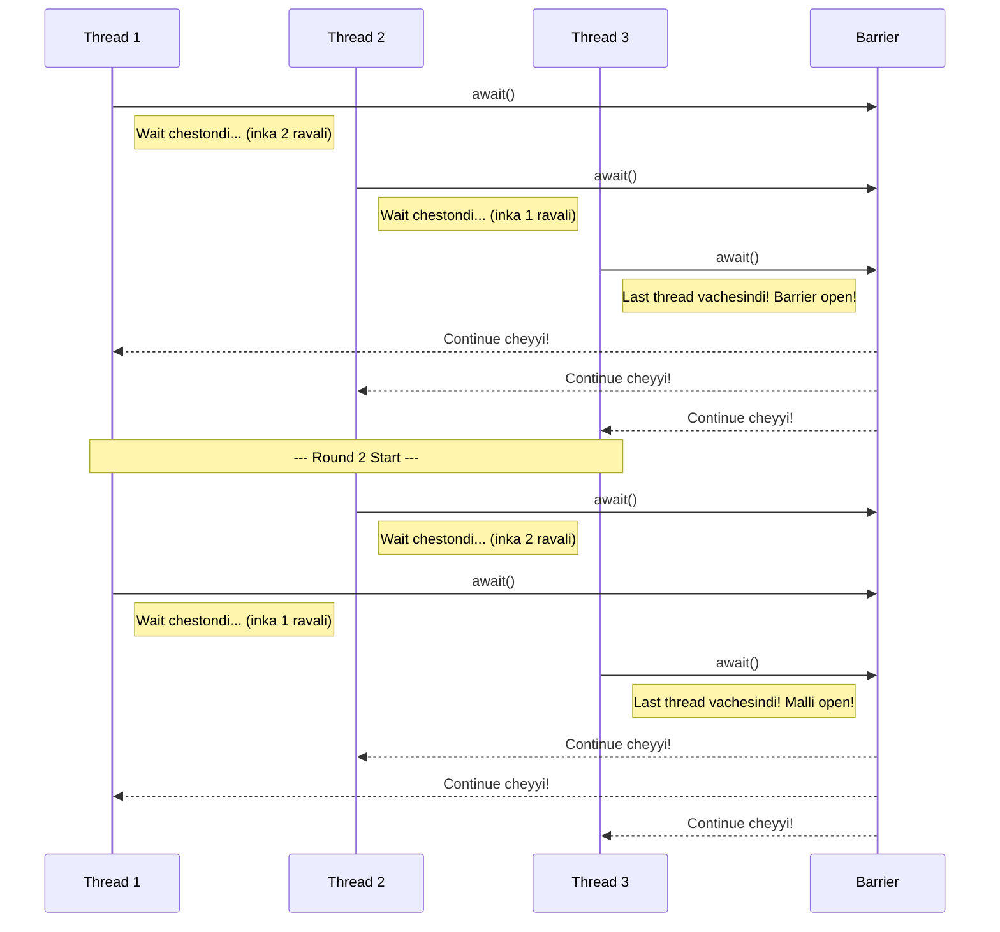

<!--
---
title: "Synchronizer: CyclicBarrier"
---
-->

> **Learning Path Position**
>
> Phase 9: Synchronizers ➔ **Chunk 2: CyclicBarrier**

> **Prerequisites**
>
> *   Phase 9, Chunk 1: `CountDownLatch` (Compare cheyyadaniki chala avasaram)
> *   Phase 6: Executor Framework

> **Coming After This**
>
> *   Phase 9, Chunk 3: `Semaphore`
> *   Phase 9, Chunk 4: `Exchanger` and `Phaser`

---

### 🚀 1. What & Why: `CyclicBarrier`?

Mawa, poyina chunk lo `CountDownLatch` gurinchi chusam, adi oka one-way, one-time gate ani. Ante, oka main thread workers kosam wait chestundi. Kani okavela a threads okari kosam okaru wait cheyyali ante? Anni threads oka common point ki vachaka, andaru kalisi munduku vellali. Malli ide pani chala sarlu cheyyali anuko?

Appude `CyclicBarrier` vastundi. Peru lo ne ardam undi:
*   **Cyclic:** Idi reusable. Anni threads barrier ki reach ayyaka, adi next round kosam reset avutundi.
*   **Barrier:** Idi oka synchronization point, anni threads oche varaku block chestundi.

**Deeni valla use enti? 🤔**

*   **Parallel Algorithms ➗:** Chala algorithms, special ga scientific computing lo, oka problem ni chinnaga break chestayi. Prathi part parallel ga solve avutundi, kani anni threads sync ayyi, results exchange chesukunnake next step ki veltayi. Deeniki idi perfect use case.
*   **Multiplayer Gaming 🎮:** Oka multiplayer game lobby imagine chesuko. Game start avvali ante, for example 8 players join avvali. `CyclicBarrier` 8th player oche varaku anni player threads ni hold chestundi.
*   **Simulation & Testing 🔬:** Multiple actors unna complex scenarios ni simulate cheyyadaniki, valla actions ni synchronized phases lo cheyyadaniki idi vaadochu.

---

### analogy 2. Real-World Analogy: Friends on a Road Trip 🚗💨

Imagine chesuko, nuvvu mariyu nee mugguru friends (total 4 members) oka road trip ki veltunnaru, chala destinations unnayi.

*   **The Barrier:** Meerandaru City A lo kalusukovali ani decide ayyaru, evaru kuda City B ki start cheyyadaniki mundu. `CyclicBarrier` ni 4 count tho initialize chestav.
*   **`await()`:** Prathi friend City A ki cherukogane, "check in" (ante `await()` call cheyyadam) chesi, meeting spot lo wait chestadu. Nuvvu first vasthe, mugguru kosam wait chestav. Nuvvu moodo vadivi aite, inkokari kosam wait chestav.
*   **Barrier Opens:** Eppaite nalugo and final friend City A ki vastado, barrier "open" avutundi. Ippudu andaru kalisi City B ki drive cheyyochu.
*   **Cyclic Nature:** Barrier automatic ga reset avutundi. Malli City B lo ade process repeat avutundi. Andaru City C ki velle mundu, City B lo okari kosam okaru wait chestaru.

Trip lo enni destinations unte anni sarlu idi continue avutundi. Ee barrier cyclic and reusable.

---

### 🧠 3. Mental Model (Mermaid Diagram)



---

### ✍️ 4. Detailed Explanation & Key Methods

*   `CyclicBarrier(int parties)`: `parties` antha mandi threads `await()` call cheste, ee barrier trip avutundi.

*   `CyclicBarrier(int parties, Runnable barrierAction)`: Idi inkonchem advanced constructor. Ee `barrierAction` anedi oka `Runnable` task, adi **last thread** barrier ki cherukunnaka, migatha threads release avvadaniki mundu, execute avutundi. Phases madhya aggregation or setup lanti panulaki idi perfect.

*   `int await() throws InterruptedException, BrokenBarrierException`: Ide main method. Thread deenini call chesi, `parties` antha mandi vachesaruku block avutundi. Idi oka `int` ni return chestundi, adi aa thread "arrival index" (ante `parties - 1` nunchi `0` varaku). `0` ante, ee thread last vachindi ani.

*   `isBroken()`: Barrier "broken" state lo unte `true` return chestundi. Barrier break avvadaniki chala reasons undochu - thread wait chestunnappudu interrupt avvadam, timeout avvadam, leda reset cheyyadam.

*   `reset()`: Barrier ni initial state ki reset chestundi. Idi error recovery kosam vaadataru. Wait chestunna threads ki `BrokenBarrierException` vastundi.

---

### 💻 5. Code Example: Parallel Array Summation

**Scenario:** Manam oka pedda array lo unna elements ni sum cheyyali. Ee pani ni chala threads ki panchi pedadam. Prathi "phase" lo, prathi thread oka chunk of array ni process chestundi. Prathi phase taruvatha, oka barrier action partial sums ni aggregate chesi, next phase start ayye mundu progress ni print chestundi.

**👎 Failure Case (`BrokenBarrierException`):**
Okavela oka worker thread interrupt aite leda `await()` lo chala time aagi timeout aipothe, migatha wait chestunna threads anni ventane `BrokenBarrierException` ni throw chestayi. Appudu barrier break aipotundi and reset cheste tappa adi paniki radu.

**✅ Success Case & Complete Solution:**

```java
import java.util.concurrent.BrokenBarrierException;
import java.util.concurrent.CyclicBarrier;
import java.util.concurrent.ExecutorService;
import java.util.concurrent.Executors;
import java.util.concurrent.atomic.AtomicInteger;

class ComputationTask implements Runnable {
    private final int id;
    private final CyclicBarrier barrier;
    private final AtomicInteger partialSum; // Ee thread result store cheyyadaniki

    public ComputationTask(int id, CyclicBarrier barrier, AtomicInteger partialSum) {
        this.id = id;
        this.barrier = barrier;
        this.partialSum = partialSum;
    }

    @Override
    public void run() {
        try {
            System.out.println("Thread " + id + " phase 1 computation start chestondi.");
            partialSum.addAndGet(10); // Pani ni simulate cheddam
            Thread.sleep((long) (Math.random() * 1000));
            System.out.println("Thread " + id + " barrier ki reach aindi.");
            barrier.await(); // Migatha vaalla kosam wait cheyyi

            System.out.println("Thread " + id + " phase 2 computation start chestondi.");
            partialSum.addAndGet(20); // Inkonchem pani
            Thread.sleep((long) (Math.random() * 1000));
            System.out.println("Thread " + id + " malli barrier ki reach aindi.");
            barrier.await(); // Malli wait cheyyi

            System.out.println("Thread " + id + " pani purthi chesindi.");

        } catch (InterruptedException | BrokenBarrierException e) {
            System.err.println("Thread " + id + " interrupt aindi leda barrier break aindi.");
            Thread.currentThread().interrupt();
        }
    }
}

public class CyclicBarrierDemo {
    public static void main(String[] args) {
        final int NUM_THREADS = 3;
        final AtomicInteger totalSum = new AtomicInteger(0);
        final AtomicInteger[] partialSums = new AtomicInteger[NUM_THREADS];

        // Ee barrier action anni threads barrier ki vachaka run avutundi
        Runnable barrierAction = () -> {
            int currentPhaseSum = 0;
            for (AtomicInteger partial : partialSums) {
                currentPhaseSum += partial.get();
            }
            totalSum.set(currentPhaseSum);
            System.out.println("======================================");
            System.out.println("🎉 BARRIER TRIPPED! Ippati varaku total sum: " + totalSum);
            System.out.println("======================================");
        };

        CyclicBarrier barrier = new CyclicBarrier(NUM_THREADS, barrierAction);
        ExecutorService executor = Executors.newFixedThreadPool(NUM_THREADS);

        for (int i = 0; i < NUM_THREADS; i++) {
            partialSums[i] = new AtomicInteger(0);
            executor.submit(new ComputationTask(i, barrier, partialSums[i]));
        }

        executor.shutdown();
    }
}
```

**Output Analysis:**
Mundu 3 threads "phase 1" start cheyyadam chustav. Avi different times lo barrier ki reach avutayi. Kani evaru kuda "phase 2" start cheyyaru, mugguru vachesaruku. Moodo thread `await()` call cheyyagane, `barrierAction` run ayyi total sum ni print chestundi. Taruvatha, andaru 3 threads okesari "phase 2" start cheyyadaniki release avutaru. Malli ade process repeat avutundi.

---

### 🆚 6. `CyclicBarrier` vs. `CountDownLatch`

Idi oka classic interview question, Mawa.

| Feature             | `CountDownLatch`                                    | `CyclicBarrier`                                           |
| ------------------- | --------------------------------------------------- | --------------------------------------------------------- |
| **Main Purpose**    | Oka thread *migatha* operations complete avvadaniki wait chestundi. | Oka group of threads *okari kosam okaru* wait chestaru. |
| **Reusability**     | **Ledu.** Idi one-time event. Reset cheyyalem.      | **Avunu.** Idi cyclic and automatic ga reset avutundi. |
| **Primary Method**  | `countDown()` taggistundi, `await()` zero kosam wait chestundi.  | `await()` okate method. Idi taggistundi and wait chestundi.    |
| **Analogy**         | Race starting gate (main thread horses kosam wait chestundi).  | Friends on a road trip (andaru friends okari kosam okaru wait chestaru). |
| **Barrier Action**  | Alantidi em ledu.                              | Avunu, barrier trip ayinappudu oka `Runnable` execute avutundi. |

---

### 🔑 7. Key Takeaways

1.  **Peer Synchronization:** `CyclicBarrier` anedi peer threads okari kosam okaru wait cheyyadaniki.
2.  **Idi Reusable:** Deeni main feature entante cyclic nature. Multi-phase tasks kosam design chesaru.
3.  **Barrier Action:** Optional `Runnable` action anedi phases madhya aggregation or setup lanti panulu cheyyadaniki oka powerful feature.
4.  **Broken State:** Okavela oka thread fail aite, barriers "break" avvochu. Appudu `BrokenBarrierException` vachi anni threads aagipotayi.
5.  **Choose the Right Tool:** "Master/Worker" scenarios ki `CountDownLatch` vaadali. "Andaru Peers okari kosam okaru wait cheyyali" ane scenarios ki `CyclicBarrier` vaadali.

---

### 🏋️ 8. Practice Exercises

1.  **Multiplayer Game Lobby:**
    *   Oka game lobby simulation create cheyyi, deeniki 4 players kavali match start cheyyadaniki.
    *   Oka `Player` `Runnable` class create cheyyi, adi lobby ki connect avvadam simulate cheyyali.
    *   4 parties tho `CyclicBarrier` vaadali.
    *   Prathi `Player` thread "Player X connected, waiting for more players..." ane message print chesi `await()` call cheyyali.
    *   Last player vachinappudu oka `barrierAction` trigger avvali, adi "All players connected! Starting the game in 3... 2... 1... GO!" ani print cheyyali.

### ✅ Checkpoint

*   Anni threads barrier ni daataka, `CyclicBarrier` ki emi avutundi?
*   `barrierAction` `Runnable` ni evaru execute chestaru?
*   `BrokenBarrierException` ante enti and adi eppudu vastundi?
*   `CyclicBarrier` correct choice and `CountDownLatch` wrong choice ayye oka scenario cheppu.

---
