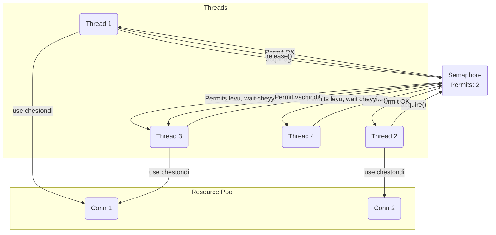

<!--
---
title: "Synchronizer: Semaphore"
---
-->

> **Learning Path Position**
>
> Phase 9: Synchronizers ➔ **Chunk 3: Semaphore**

> **Prerequisites**
>
> *   Phase 2: `synchronized` and Locks (compare cheyyadaniki)
> *   Resource pooling gurinchi basic knowledge.

> **Coming After This**
>
> *   Phase 9, Chunk 4: `Exchanger` and `Phaser`
> *   Hands-On Mini-Project: Concurrent File Downloader

---

### 🚀 1. What & Why: `Semaphore`?

Mawa, ippativaraku manam locks (`synchronized`, `ReentrantLock`) chusam, avi exclusive access istayi. Ante, okate thread lock ni tesukogaladu. Kani okavela nee daggara oka pool of resources unnay anuko— উদাহরনস্বরূপ, 3 database connections—mariyu nuvvu 3 threads ni okesari access ivvali anukuntunnav.

Ee pani kosam `Semaphore` ane tool undi. Idi oka synchronizer, adi konni "permits" ni maintain chestundi. Oka thread resource access cheyyali ante, mundu oka permit `acquire` cheyyali, pani aipoyaka aa permit ni `release` cheyyali, appudu inkoka thread aa permit ni tesukuntundi.

**Deeni valla use enti? 🤔**

*   **Resource Pooling 🏊:** Ide classic use case. Database connections, network sockets, or lanti finite resources ki concurrent access ni limit cheyyadam.
*   **Rate Limiting 🚦:** System mida ekkuva load padakunda, konni operations entha speed lo jaragalo anedi semaphore tho control cheyyochu.
*   **Throttling 🤏:** Oka particular code block ni entha mandi threads okesari execute cheyyagalaro anedi limit cheyyadam.

---

### analogy 2. Real-World Analogy: A Bouncer at a Club 🕺💃

Oka popular nightclub undi, daani capacity limit 100 people anuko.

*   **The Semaphore:** Aa club bouncer ee mana semaphore, 100 permits tho initialize aindi (`new Semaphore(100)`).
*   **`acquire()`:** Nuvvu club loki vellali anukunnapudu, bouncer daggiriki veltav. Club full ga lekapothe (permits > 0), bouncer ninnu lopiliki pampi, tana counter lo okati taggistadu. Nuvvu oka permit "acquire" chesukunnav. Okavela club full aipothe (permits = 0), nuvvu bayata line lo wait cheyyali.
*   **`release()`:** Nuvvu club nunchi bayatiki vachinappudu, bouncer tana counter lo okati penchutadu. Nuvvu nee permit ni "release" chesav, ippudu bayata line lo unna okaru lopiliki vellachu.

Bouncer ki lopala *evaru* unnaru anedi anavasaram, *entha mandi* unnaru anede mukhyam.

---

### 🧠 3. Mental Model (Mermaid Diagram)



---

### ✍️ 4. Detailed Explanation & Key Methods

Semaphore antha daani counter (available permits) mida aadharapadi untundi.

*   `Semaphore(int permits)`: Ichina permits tho semaphore create chestundi. Idi default ga "non-fair" semaphore.

*   `Semaphore(int permits, boolean fair)`: Okavela `fair` `true` aite, semaphore threads request chesina order lo ne permits istundi (FIFO). Non-fair (default) aite, kotthaga vachina thread kuda wait chestunna thread kanna mundu permit పొందవచ్చు. Non-fair semaphores chala fast ga untayi.

*   `void acquire() throws InterruptedException`: Semaphore nunchi oka permit tesukuntundi, okati dorike varaku block avutundi. Idi permit count ni taggistundi.

*   `void release()`: Oka permit ni release chesi, semaphore ki tirigi istundi. Idi permit count ni penchutundi. Deeni valla `acquire()` lo wait chestunna thread unblock avvochu.

*   `boolean tryAcquire()`: Idi non-blocking version. Permit kosam try chestundi. Success aite `true` return chestundi, lekapothe block avvakunda ventane `false` return chestundi.

*   `int availablePermits()`: Enni permits available ga unnayo return chestundi.

**Binary Semaphore:** Okate permit tho unna semaphore (`new Semaphore(1)`) ni lock laaga use cheyyochu. Kani deeni badulu `ReentrantLock` vaadadam better, endukante semaphores **not reentrant**. Okavela oka thread permit tesukuni, malli tesukovali anukunte, adi eppatiki block aipotundi.

---

### 💻 5. Code Example: Database Connection Pool

**Scenario:** Mana daggara oka connection pool undi, adi maximum 3 concurrent database connections ni matrame support chestundi. Chala threads ee connections ni vaadali anukuntunnayi.

**👎 Failure Case (Permit Leak):**
Okavela oka thread connection acquire chesaka, `release()` call cheyyaka munde exception vaste, aa permit eppatiki lost aipotundi. Pool lo available connections permanent ga taggipotayi. Last ki anni permits leak aipoyi system antha aagipotundi.

**✅ Success Case & Complete Solution (using `try...finally`):**

```java
import java.util.concurrent.Semaphore;
import java.util.concurrent.ExecutorService;
import java.util.concurrent.Executors;
import java.util.concurrent.TimeUnit;

// Limited resources unna pool ni simulate chestundi
class ConnectionPool {
    private final int MAX_CONNECTIONS = 3;
    private final Semaphore semaphore = new Semaphore(MAX_CONNECTIONS, true); // Fair semaphore

    public void useConnection(int threadId) {
        try {
            System.out.println("Thread " + threadId + " connection acquire cheyyadaniki try chestondi...");
            semaphore.acquire(); // Permits lekapothe block avutundi

            // --- Critical Section Start ---
            System.out.println("✅ Thread " + threadId + " connection acquire chesukundi. " +
                               "Available permits: " + semaphore.availablePermits());
            // Connection tho pani simulate cheddam
            Thread.sleep(2000);
            System.out.println("... Thread " + threadId + " pani purthi chesindi.");
            // --- Critical Section End ---

        } catch (InterruptedException e) {
            Thread.currentThread().interrupt();
            System.err.println("Thread " + threadId + " interrupt aindi.");
        } finally {
            // Idi non-negotiable! Permit ni pakka ga release cheyyali.
            System.out.println(" Thread " + threadId + " connection ni release chestondi...");
            semaphore.release();
        }
    }
}

public class SemaphoreDemo {
    public static void main(String[] args) {
        ConnectionPool pool = new ConnectionPool();
        // 10 threads create cheddam, avi 3 connections kosam compete avutayi
        ExecutorService executor = Executors.newFixedThreadPool(10);

        for (int i = 0; i < 10; i++) {
            final int threadId = i;
            executor.submit(() -> pool.useConnection(threadId));
        }

        executor.shutdown();
        try {
            executor.awaitTermination(1, TimeUnit.MINUTES);
        } catch (InterruptedException e) {
            Thread.currentThread().interrupt();
        }
        System.out.println("Anni threads aipoyayi.");
    }
}
```

**Output Analysis:**
Mundu 3 threads ventane connections acquire chesukovadam chustav. "Available permits" 0 ki padipotundi. Migatha 7 threads block ayyi, wait chestu untayi. Eppaite aa 3 threads lo okati tana pani purthi chesi permit ni release chestundo, ventane wait chestunna threads lo okati daanni acquire chesukuni pani start chestundi. Anni 10 threads aipoye varaku ide continue avutundi.

---

### 🔗 6. Concept Connections

*   **`ReentrantLock` (Phase 4):** Okate permit unna semaphore lock laantide, kani adi **not reentrant**. Lock ni ade thread chala sarlu acquire cheyyochu; semaphore ni cheyyalem.
*   **Resource Management:** Semaphores anevi resource pools build cheyyadaniki oka fundamental tool.

### 🐛 7. Debugging & Testing

*   **Deadlock/Stuck Threads:** Nee application freeze ayyi, thread dump lo chala threads `semaphore.acquire()` daggara `BLOCKED` ga unte, neeku pakka ga **permit leak** aindi ani ardam. Edo oka code path `release()` call cheyyatledu.
*   **The `finally` Block:** Permit leaks ki solution entante, `acquire()` nunchi `release()` varaku unna antha code ni `try...finally` block lo petti, `release()` ni `finally` lo pettali.
*   **Fairness vs. Performance:** Testing kosam fair semaphore predictable ga untundi. Production lo, non-fair semaphore chala fast ga untundi, so starvation prevent cheyyali anukunte tappa fairness vadaku.

### 👎 8. Anti-Patterns & Common Mistakes

*   **`release()` marchipovadam:** Ide semaphores use chestunnapudu chese pedda paapam. Idi resource leaks ki and system failure ki dari teestundi.
*   **Mutex la vaadadam:** `new Semaphore(1)` ni simple lock la vaadadam. `ReentrantLock` better choice, endukante adi reentrant and daani purpose clear ga untundi.
*   **Acquire cheyyakunda Release cheyyadam:** `acquire()` cheyyani thread `release()` call cheyyadam. Idi permit count ni penchutundi and nee resource pool logic ni break cheyyochu.

### 🔑 9. Key Takeaways

1.  **Counting Lock:** Semaphore anedi oka lock laantidi, daanni oka specified limit varaku multiple threads hold cheyyochu.
2.  **`acquire()`/`release()`:** Threads resource kosam `acquire()` chestaru and pani aipoyaka `release()` chestaru.
3.  **Resource Pooling:** Deeni primary use case entante finite pool of resources ki concurrent access ni control cheyyadam.
4.  **`finally` is Mandatory:** Resource leaks avvakunda undali ante, `release()` ni `finally` block lo ne pettali.
5.  **Fairness is a Trade-off:** Fair semaphores starvation ni aputayi kani non-fair semaphores kanna takkuva throughput istayi.

---

### 🏋️ 10. Practice Exercises

1.  **Rate Limiter:**
    *   Oka `RateLimiter` class create cheyyi, daanilo `execute(Runnable task)` ane method undali.
    *   Aa `RateLimiter` ni for example, 5 tasks ni matrame concurrently execute cheyyadaniki configure cheyyali.
    *   5 tho initialize chesina `Semaphore` vaadali. `execute` method task run cheyyaka mundu permit `acquire` cheyyali and taruvatha `release` cheyyali.
    *   20 tasks ni different threads nunchi submit chesi test cheyyi, and 5 kanna ekkuva okesari run avvakunda chusko.

### ✅ Checkpoint

*   `Semaphore` ki mariyu `ReentrantLock` ki madhya unna difference enti?
*   "Permit leak" ante enti and daanni ela prevent chestav?
*   Fair and non-fair semaphore ki madhya unna difference enti? Edi fast ga untundi?
*   Permit `acquire` cheyyani thread `release()` call cheyyagalada? Appudu emi avutundi?

---
