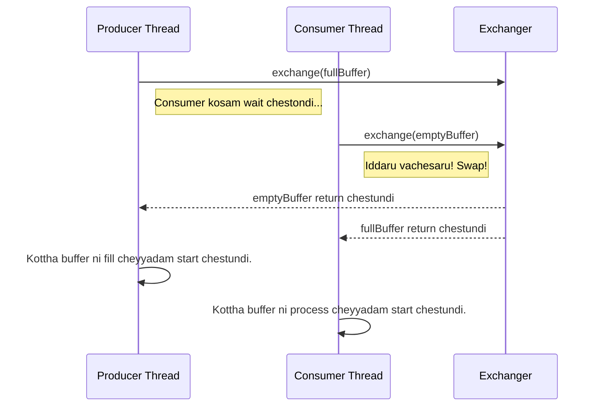

<!--
---
title: "Advanced Synchronizers: Exchanger and Phaser"
---
-->

> **Learning Path Position**
>
> Phase 9: Synchronizers ➔ **Chunk 4: Exchanger & Phaser**

> **Prerequisites**
>
> *   Phase 9, Chunk 1 & 2: `CountDownLatch` and `CyclicBarrier` (Phaser ee concepts mida build aindi).
> *   Phase 8: `BlockingQueue` (Exchanger konni producer-consumer scenarios ki alternative).

> **Coming After This**
>
> *   Idi Phase 9 lo final theory chunk. Next Hands-On Mini-Project!

---

### 🚀 1. What & Why: Advanced Synchronizers?

Mawa, ippativaraku manam "big three" synchronizers chusam. Ippudu inka rendu specialized, kani chala powerful, tools chuddam: `Exchanger` and `Phaser`.

*   `Exchanger`: Idi oka chala specific pani kosam: rendu threads ni oka synchronization point daggara kalipi, data ni swap chesukovadaniki.
*   `Phaser`: Idi oka super-flexible barrier. `CountDownLatch` and `CyclicBarrier` features ni kalipi, participating threads number ni dynamically change chese sakthi istundi.

Ive antha common ga kanipinchavu, kani avasaram vachinappudu, ive a paniki perfect tools.

---

### 💱 Part 1: `Exchanger`

Idi ardham chesukovadaniki chala simple synchronizer.

#### analogy Real-World Analogy: Spy Briefcase Swap 🕵️

Iddaru spies ni imagine chesuko, Spy A and Spy B.
*   Spy A daggara secret documents unna briefcase undi.
*   Spy B daggara payment unna briefcase undi.
*   Valliddaru midnight oka park bench daggara kalisi swap chesukovali ani decide ayyaru.

Aa park bench ee `Exchanger`. Spy A mundu vastadu, tana briefcase petti, wait chestadu. Athanu block avutadu. Spy B vastadu, tana briefcase pedatadu, ventane swap jarugutundi. Spy A, Spy B briefcase tesukuntadu, and Spy B, Spy A briefcase tesukuntadu. Taruvatha idadru vellipotaru.

Deenilo main point entante, ee exchange anedi **atomic**. Iddaru unte ne jarugutundi.

#### 🧠 Mental Model (Mermaid Diagram)



#### ✍️ Detailed Explanation

`Exchanger<V>` anedi oka generic class, `V` anedi exchange ayye object type. Deeniki okate oka main method undi:

*   `V exchange(V x) throws InterruptedException`:
    *   First thread `exchange(dataA)` call chesinappudu, adi block ayyi second thread kosam wait chestundi.
    *   Second thread `exchange(dataB)` call chesinappudu, exchange jarugutundi.
    *   First thread call ki `dataB` return avutundi.
    *   Second thread call ki `dataA` return avutundi.

Idi konni producer-consumer patterns lo, manam entire collections or buffers ni swap cheyyali anukunnapudu, two-way `BlockingQueue` ki oka powerful alternative.

#### 💻 Code Example: Producer-Consumer Buffer Swap

**Scenario:** Oka `Producer` thread continuously oka buffer ni data tho fill chestundi. Oka `Consumer` thread aa data ni process chestundi. Individual items ni queue dwara pampadam badulu, vallu entire buffers ni swap chesukuntaru. Idi chala efficient ga untundi, endukante lock/unlock operations taggutayi.

```java
import java.util.ArrayList;
import java.util.List;
import java.util.concurrent.Exchanger;

public class ExchangerDemo {

    public static void main(String[] args) {
        Exchanger<List<String>> exchanger = new Exchanger<>();

        // Producer Thread
        new Thread(() -> {
            List<String> buffer = new ArrayList<>();
            try {
                for (int i = 1; i <= 5; i++) {
                    System.out.println("Producer buffer fill chestondi...");
                    buffer.add("Data-" + i);
                    Thread.sleep(1000);
                }
                System.out.println("Producer daggara full buffer undi, exchange ki ready.");
                // Full buffer ni consumer daggara unna empty buffer tho swap cheyyi
                buffer = exchanger.exchange(buffer);
                System.out.println("Producer ki empty buffer vachindi. Size: " + buffer.size());
            } catch (InterruptedException e) {
                Thread.currentThread().interrupt();
            }
        }).start();

        // Consumer Thread
        new Thread(() -> {
            List<String> buffer = new ArrayList<>();
            try {
                System.out.println("Consumer daggara empty buffer undi, exchange kosam waiting.");
                // Empty buffer ni producer daggara unna full buffer tho swap cheyyi
                buffer = exchanger.exchange(buffer);
                System.out.println("✅ Consumer ki full buffer vachindi! Processing...");
                buffer.forEach(System.out::println);
            } catch (InterruptedException e) {
                Thread.currentThread().interrupt();
            }
        }).start();
    }
}
```
**Output Analysis:** Producer 5 seconds lo tana buffer ni fill chestadu. Consumer start ayyi ventane `exchange()` daggara block avutadu. Eppaite producer kuda `exchange()` call chestado, swap ventane jarugutundi. Consumer ki 5 data items unna list vastundi, and producer ki empty list tirigi vastundi.

---

### 🏰 Part 2: `Phaser`

`Phaser` anedi `CyclicBarrier` and `CountDownLatch` ki steroids ichinattu untundi.

#### analogy Real-World Analogy: A Tour Guide 🗺️

Oka tour guide oka pedda museum lo tourists group ni manage chestunnadu anuko.
*   **Phases:** Tour lo chala phases unnayi: "Entrance daggara kalavadam," "Dinosaur Exhibit chudam," "Space Exhibit chudam," "Gift shop daggara kalavadam."
*   **Arrival:** Tour guide (`Phaser`) prathi meeting point daggara, andaru registered tourists vachesaruku wait chestadu (`arriveAndAwaitAdvance`).
*   **Dynamic Parties:**
    *   Oka kottha tourist madyalo group lo join avvochu (`register`).
    *   Oka tourist alasipoyi tour nunchi vellipovachu (`arriveAndDeregister`).
*   **Hierarchical:** Aa guide inka vere tour guides tho (child phasers) coordinate chesukuni, pedda groups ni kuda manage cheyyochu.

`Phaser` ivi anni cheyyagaladu. Adi oka group of threads (parties) ni multiple synchronized phases dwara manage chestundi, and aa parties number eppudaina marochu.

#### ✍️ Detailed Explanation

Oka `Phaser` state lo rendu numbers untayi: **phase number** (0 tho start avutundi) and **registered parties** number.

*   `register()`: Phaser ki oka kottha party ni add chestundi.
*   `arrive()`: Oka party current phase kosam barrier ki vachesanu ani cheptundi. Idi non-blocking call.
*   `arriveAndAwaitAdvance()`: Oka party vachi, migatha anni registered parties vachesaruku block avutundi. Ide `CyclicBarrier.await()` laaga, chala common ga use chestaru.
*   `arriveAndDeregister()`: Oka party current phase kosam vachi, taruvatha de-register chesukuntundi. Future phases lo deeni kosam wait cheyyaru.
*   `getPhase()`: Current phase number istundi.
*   `onAdvance(int phase, int registeredParties)`: Idi manam override cheyyagala method (`Phaser` ni subclass chesi). Idi barrier action la pani chestundi. Phase aipoyaka idi call avutundi. Idi `true` return cheste, phaser terminate avutundi.

#### 💻 Code Example: Multi-Phase Task with Dynamic Workers

**Scenario:** Mana daggara 3 phases unna oka task undi. Manam 3 worker threads tho start chestam. Phase 1 taruvatha, oka worker tana pani purthi chesi vellipotadu. Phase 2 ki mundu, oka kottha worker, late ga vachi join avutadu.

```java
import java.util.concurrent.Phaser;
import java.util.concurrent.TimeUnit;

class DynamicWorker implements Runnable {
    private final String name;
    private final Phaser phaser;

    public DynamicWorker(String name, Phaser phaser) {
        this.name = name;
        this.phaser = phaser;
        phaser.register(); // Ee worker ni phaser tho register cheyyi
        System.out.println(name + " register aindi.");
    }

    @Override
    public void run() {
        try {
            System.out.println(name + " phase " + phaser.getPhase() + " start chestondi");
            phaser.arriveAndAwaitAdvance(); // Vachi migathavalla kosam wait cheyyi

            // --- Phase 1 ---
            System.out.println(name + " phase " + phaser.getPhase() + " start chestondi");
            TimeUnit.SECONDS.sleep(1);

            if (name.equals("Worker-2")) {
                System.out.println(name + " pani aipoindi, de-register avutondi.");
                phaser.arriveAndDeregister(); // Vachi group nunchi vellipo
            } else {
                phaser.arriveAndAwaitAdvance();
            }

            // --- Phase 2 ---
            // Ikkada Worker-1 and Worker-3 matrame unnaru
            System.out.println(name + " phase " + phaser.getPhase() + " start chestondi");
            phaser.arriveAndAwaitAdvance();

            System.out.println(name + " anni phases purthi chesindi.");

        } catch (InterruptedException e) {
            Thread.currentThread().interrupt();
        }
    }
}

public class PhaserDemo {
    public static void main(String[] args) throws InterruptedException {
        Phaser phaser = new Phaser(1); // Main thread ni register cheyyi

        new Thread(new DynamicWorker("Worker-1", phaser)).start();
        new Thread(new DynamicWorker("Worker-2", phaser)).start();

        System.out.println("Main thread phase 0 kosam wait chestondi. Parties: " + phaser.getRegisteredParties());
        phaser.arriveAndAwaitAdvance(); // Main thread 2 workers register ayyevaraku wait chestundi

        System.out.println("\n--- Phase 1 Start ---");
        phaser.arriveAndAwaitAdvance(); // Main workers phase 1 purthi chesevaraku wait chestundi

        System.out.println("\n--- Phase 2 Start ---");
        // Oka kottha worker join avutunnadu!
        new Thread(new DynamicWorker("Worker-3 (Late)", phaser)).start();
        phaser.arriveAndAwaitAdvance(); // Main migatha workers phase 2 purthi chesevaraku wait chestundi

        System.out.println("\n--- Anni phases aipoyayi ---");
        phaser.arriveAndDeregister(); // Main thread de-register avutondi
        System.out.println("Phaser terminate aindi: " + phaser.isTerminated());
    }
}
```

---

### 🆚 7. `Phaser` vs. The World

| Feature              | `CountDownLatch` | `CyclicBarrier`             | `Phaser`                                         |
| -------------------- | ---------------- | --------------------------- | ------------------------------------------------ |
| **Reusable?**        | Ledu             | Avunu                       | Avunu                                            |
| **Dynamic Parties?** | Ledu             | Ledu                        | **Avunu** (register/deregister)                  |
| **Barrier Action?**  | Ledu             | Avunu (`Runnable`)          | Avunu (`onAdvance` method)                       |
| **Complexity**       | Low              | Medium                      | High                                             |
| **Best For**         | One-shot N:1 waits | Multi-phase, fixed parties | Multi-phase, **dynamic** or hierarchical parties |

---

### 🔑 8. Key Takeaways

1.  **`Exchanger` for Swapping:** Efficient, two-party data swaps kosam `Exchanger` vaadali. Idi konni producer-consumer patterns kosam oka niche kani powerful tool.
2.  **`Phaser` for Flexibility:** `Phaser` anedi JDK lo unna aalinganamaindi barrier. Idi reusable barriers ni dynamically change ayye number of threads tho handle chestundi.
3.  **Dynamic Registration:** `register()` and `arriveAndDeregister()` cheyyagalagadam anede `Phaser` ni `CyclicBarrier` nunchi veru chese main feature.
4.  **Complexity Trade-off:** Ekkuva power tho paatu ekkuva complexity vastundi. `Phaser` ni correct ga use cheyyadam konchem kashtam. Nee use case ki `CountDownLatch` or `CyclicBarrier` saripothe, ave prefer cheyyi.

---

### 🏋️ 9. Practice Exercises

1.  **Exchanger Pipeline:**
    *   Rendu `Exchanger`s use chesi oka three-stage pipeline create cheyyi.
    *   Thread A data generate chesi, Thread B tho exchange chestundi.
    *   Thread B, A nunchi vachina data ni process chesi, result ni Thread C tho exchange chestundi.
    *   Thread C final result ni consume chestundi.

2.  **Phaser Build System:**
    *   `COMPILE`, `TEST`, `DEPLOY` ane 3 phases unna oka software build process ni simulate cheyyi.
    *   `Phaser` vaadali. Mundu 3 `Compiler` threads ni register cheyyi.
    *   `COMPILE` phase aipoyaka, anni `Compiler` threads de-register avvali.
    *   Taruvatha, 5 `Tester` threads ni register cheyyi.
    *   `TEST` phase aipoyaka, anni `Tester` threads de-register avvali.
    *   Final ga, 2 `Deployer` threads ni register chesi last phase purthi cheyyi.

### ✅ Checkpoint

*   Iddaru threads already `Exchanger` lo unte, moodo thread `exchange()` call cheste emi avutundi?
*   `CyclicBarrier` kanna `Phaser` lo unna main advantage enti?
*   Oka thread `Phaser` nunchi permanently ela vellipotundi, so that future phases lo daani kosam wait cheyyaru?
*   `Phaser` lo, `arrive()` ki and `arriveAndAwaitAdvance()` ki madhya unna difference enti?

---
