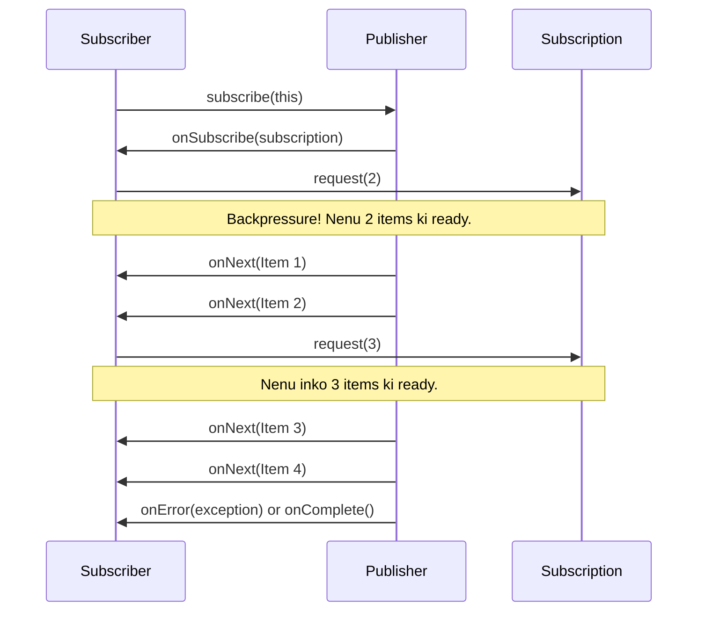

<!--
---
title: "Reactive Streams & The Flow API"
---
-->

> **Learning Path Position**
>
> Phase 11: Modern Concurrency ➔ **Chunk 1: Reactive Streams & The Flow API**

> **Prerequisites**
>
> *   Phase 8: `BlockingQueue` (Producer-Consumer pattern ni ardham chesukovadaniki)
> *   Phase 7: `CompletableFuture` (Asynchronous programming gurinchi basic idea undali)

> **Coming After This**
>
> *   Phase 11, Chunk 2: Virtual Threads (Project Loom)
> *   Phase 14: Real-World Applications (Reactive microservices gurinchi matladukuntam)

---

### 🚀 1. What & Why: Reactive Streams?

Mawa, ippativaraku manam chusina concurrency models anni "pull-based" or imperative. Ante, oka consumer (thread) data kavali anukunnapudu, adi source ni adugutundi (`queue.take()`, `future.get()`). Consumer control lo untundi.

**Reactive Streams** ee model ni തലകീഴായി chestundi. Idi oka **"push-based"** model. Ikkada, `Publisher` (producer) data ni `Subscriber` (consumer) ki "push" chestundi, eppaite data ready ga untundo appudu. Idi asynchronus event streams gurinchi.

Kani, ikkada oka pedda problem undi. Okavela Publisher chala fast ga unte and Subscriber chala slow ga unte? Subscriber data tho nindipotadu (`OutOfMemoryError`). Ee samasyani solve cheyyadaniki, Reactive Streams lo oka super important concept undi: **Backpressure**.

**Backpressure ante enti?** Adi Subscriber ki Publisher ni "slow down, nenu inka ready ledu!" ani cheppe mechanism. Ee model lo, consumer control ni tirigi tesukuntadu.

Java 9 lo, Reactive Streams specification ni `java.util.concurrent.Flow` API roopam lo standard library lo add chesaru.

**Deeni valla use enti? 🤔**

*   **Resilience & Stability 💪:** Backpressure valla, fast producers slow consumers ni crash cheyyavu. System stable ga untundi.
*   **Resource Efficiency ⚙️:** Unnecessary data ni buffer cheyyadam badulu, subscriber entha handle cheyyagalado antha data matrame process avutundi.
*   **Asynchronous & Non-Blocking 💨:** High-performance, non-blocking applications (like reactive microservices) build cheyyadaniki idi foundation.

---

### analogy 2. Real-World Analogy: The Sushi Conveyor Belt 🍣

Imagine oka sushi restaurant lo, oka conveyor belt undi.
*   **`Publisher` (The Chef):** Chef sushi plates chesi, belt mida pedutunnadu.
*   **`Subscriber` (You):** Nuvvu belt daggara kurchuni, plates tesukuni tintunnav.
*   **No Backpressure:** Okavela chef non-stop ga plates pedutu unte, and nuvvu slow ga tinte, nee daggara plates ekkuva aipoyi, kindapadipotayi. Nee table antha mess aipotundi.
*   **With Backpressure (`request(n)`):** Ippudu, nuvvu chef ki cheptav, "Hey, nenu ippudu 2 plates matrame tinnagalanu." Chef 2 plates petti aagipotadu. Nuvvu aa rendu tinna taruvatha, malli cheptav, "Okay, ippudu inko 3 plates pampu." Ide **Backpressure**. Nuvvu (subscriber) data flow ni control chestunnav.

---

### 🧠 3. The Java 9 `Flow` API: Core Interfaces

`Flow` API lo nalugu main interfaces unnayi.

1.  **`Flow.Publisher<T>`**: Producer. Idi `Subscriber`s ni accept chestundi. Okate oka method undi: `subscribe(Subscriber<? super T> subscriber)`.

2.  **`Flow.Subscriber<T>`**: Consumer. Idi `Publisher` nunchi events receive chesukuntundi. Deenilo nalugu important methods unnayi, ivi oka sequence lo call avutayi:
    *   `onSubscribe(Subscription subscription)`: Publisher `subscribe` method ni call cheyyagane, ee method call avutundi. Ikkada `Subscription` object vastundi, daanitho manam data ni request cheyyochu.
    *   `onNext(T item)`: Publisher nunchi oka kottha data item vachinappudu ee method call avutundi.
    *   `onError(Throwable throwable)`: Stream lo edaina error vaste ee method call avutundi.
    *   `onComplete()`: Publisher inka data pampadu ani cheppadaniki ee method call avutundi.

3.  **`Flow.Subscription`**: Idi Publisher and Subscriber madhya unna connection ni represent chestundi. Deenilo rendu main methods unnayi:
    *   `request(long n)`: Subscriber ee method use chesi, "nenu `n` items kosam ready" ani Publisher ki cheptundi. **Ide backpressure ki key.**
    *   `cancel()`: Subscriber inka data వద్దు ani cheppadaniki.

4.  **`Flow.Processor<T, R>`**: Idi Publisher and Subscriber rendu la pani chestundi. Data ni receive chesukuni, daanni transform chesi, vere subscriber ki pampistundi. Oka processing stage laantidi.



---

### 💻 4. Code Example: News Feed

**Scenario:** Manam oka `NewsPublisher` create cheddam, adi news articles publish chestundi. Taruvatha, manam oka `SlowNewsReader` (subscriber) create cheddam, adi news ni slow ga chaduvutundi and backpressure apply chestundi.

Java, `SubmissionPublisher` ane oka ready-made `Publisher` implementation istundi, adi manam ee example lo use cheddam.

```java
import java.util.concurrent.Flow;
import java.util.concurrent.Flow.Subscriber;
import java.util.concurrent.Flow.Subscription;
import java.util.concurrent.SubmissionPublisher;
import java.util.concurrent.TimeUnit;

// Mana Subscriber implementation
class SlowNewsReader implements Subscriber<String> {
    private Subscription subscription;
    private final String name;

    public SlowNewsReader(String name) {
        this.name = name;
    }

    @Override
    public void onSubscribe(Subscription subscription) {
        System.out.println(name + ": Subscription vachindi! Initial ga 1 item request chestunna.");
        this.subscription = subscription;
        // Mundu okate oka item adugu
        this.subscription.request(1);
    }

    @Override
    public void onNext(String item) {
        System.out.println("-> " + name + " ki kottha NEWS vachindi: '" + item + "'");
        try {
            // News chadavadaniki time padutundi ani simulate cheddam
            TimeUnit.SECONDS.sleep(1);
        } catch (InterruptedException e) {}

        // Okati chadavadam aipoindi, so inko item adugu
        System.out.println(name + ": Inko item request chestunna...");
        this.subscription.request(1);
    }

    @Override
    public void onError(Throwable throwable) {
        System.err.println(name + ": Oh no! Error vachindi: " + throwable.getMessage());
    }

    @Override
    public void onComplete() {
        System.out.println(name + ": Anni news articles vachesayi. Feed complete!");
    }
}


public class FlowApiDemo {
    public static void main(String[] args) throws InterruptedException {
        // 1. Publisher ni create cheyyi
        // SubmissionPublisher anedi ForkJoinPool.commonPool() ni default ga use chestundi
        SubmissionPublisher<String> publisher = new SubmissionPublisher<>();

        // 2. Subscribers ni create cheyyi
        SlowNewsReader reader1 = new SlowNewsReader("Reader-Jules");
        SlowNewsReader reader2 = new SlowNewsReader("Reader-Vincent");

        // 3. Subscribers ni Publisher tho register cheyyi
        publisher.subscribe(reader1);
        publisher.subscribe(reader2);

        // 4. News ni publish cheyyi
        List<String> newsFeed = List.of("Java 21 LTS release aindi!", "Project Loom GA aindi!", "Record Patterns production ready!", "Final news: Bye bye!");

        System.out.println("Publisher news publish cheyyadam start chestondi...");
        newsFeed.forEach(publisher::submit); // submit() anedi non-blocking

        // Publisher ni close cheyyi (idi onComplete() ni trigger chestundi)
        publisher.close();

        System.out.println("Publisher anni news ni submit chesindi.");

        // Main thread konchem sepu wait cheyyali, endukante antha asynchronus ga jarugutundi
        TimeUnit.SECONDS.sleep(5);
    }
}
```

**Output Analysis:**
Ee code run cheste, nuvvu chustav:
1.  Rendu readers okesari `onSubscribe` call chesi, okate item request chestayi.
2.  Publisher vaallaki first news item pampistadu.
3.  Prathi reader news item receive chesaka, 1 second wait chesi, taruvatha inko item request chestadu.
4.  Ee process antha news aipoye varaku continue avutundi. Publisher okesari anni news submit chesina, subscribers matram vaallaki kavalsinappude tesukuntunnaru. Ide backpressure in action.

---

### 🔗 5. Concept Connections

*   **Producer-Consumer (Phase 8):** Idi kuda oka producer-consumer pattern, kani `BlockingQueue` lanti pull-based mechanism badulu, idi backpressure tho unna push-based mechanism.
*   **Observer Design Pattern:** Reactive Streams anedi Observer pattern ki chala daggaraga untundi, kani backpressure ane extra super-power tho.
*   **RxJava, Project Reactor:** Java 9 `Flow` API ki mundu, ee third-party libraries reactive programming ni Java lo popular chesayi. `Flow` API anedi ee libraries ki interoperability kosam oka standard matrame. Real-world applications lo, `Flow` API mida build chesina ee powerful libraries ne ekkuva use chestaru.

### 👎 6. Anti-Patterns & Common Mistakes

*   **Requesting `Long.MAX_VALUE`:** `onSubscribe` lo `subscription.request(Long.MAX_VALUE)` call cheyyadam. Deeni valla, nuvvu backpressure ni bypass chestunnav. "Anni items okesari pampu" ani cheptunnav, adi `OutOfMemoryError` ki dari teeyochu.
*   **Blocking `onNext` for too long:** `onNext` method lo chala time tesukune pani cheste, adi `Publisher` ni (and daani thread) ni block cheyyochu. Heavy work ni vere thread pool ki offload cheyyali.

### 🔑 7. Key Takeaways

1.  **Push model with Backpressure:** Reactive Streams anedi "push-based" model, deenilo Subscriber `Publisher` ni slow down cheyyochu (backpressure).
2.  **`Flow` API is the Standard:** Java 9 lo `Flow` API (Publisher, Subscriber, Subscription) anedi reactive streams ki standard interface.
3.  **`subscription.request(n)` is Key:** Backpressure ni `subscription.request(n)` call chesi implement chestaru.
4.  **Asynchronous & Event-Driven:** Ee model antha asynchronous events (`onNext`, `onComplete`, `onError`) mida aadharapadi untundi.

---

### ✅ Checkpoint

*   "Pull-based" model ki and "push-based" model ki madhya unna main difference enti?
*   Reactive Streams lo, "backpressure" ante enti and adi enduku chala mukhyam?
*   `Flow.Subscriber` lo `onSubscribe` method purpose enti?
*   `onSubscribe` lo `subscription.request(Long.MAX_VALUE)` call cheyyadam enduku oka bad idea?

---
